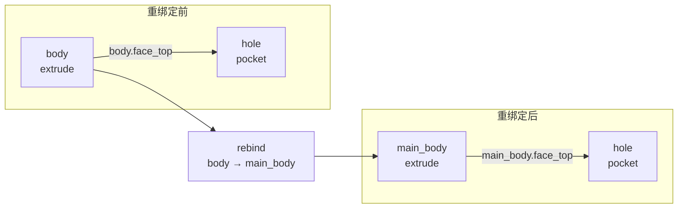
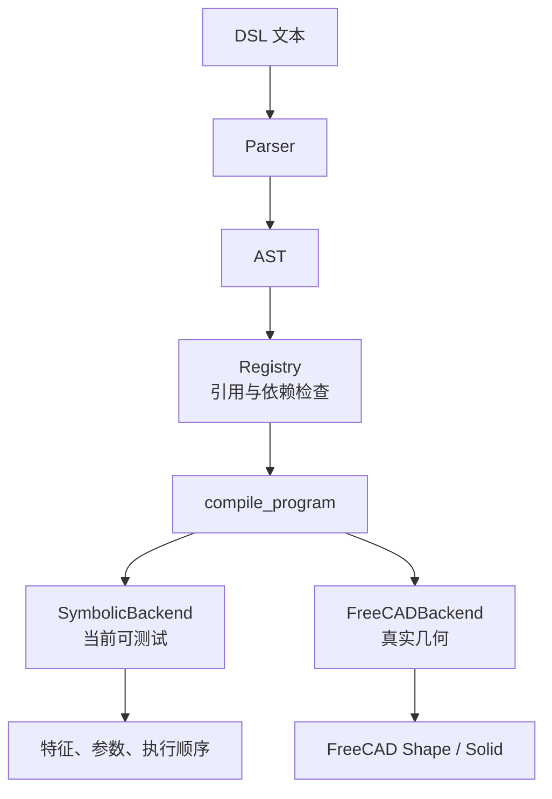

# 更新日志 / Changelog

> English milestone report: [`CHANGELOG_en_8_19.md`](CHANGELOG_en_8_19.md)

## 2026-08-19 — M2 引用管理与连续编辑基准 v1

本阶段从“DSL 能被解析”继续推进到“DSL 能检查引用、按顺序执行并对连续编辑链评分”。M2 W2～W4 已完成；M2 W1 的 FreeCAD 编译器已搭好接口和基础 `sketch`/`extrude` 路径，但完整 Part/PartDesign 操作集尚未完成，因此 M2 整体仍处于进行中。

## 1. 引用注册表与依赖图

重写 `dsl/registry.py`，把之前只有特征名集合和 TODO 的注册表扩展成连续编辑所需的符号引用管理器。

- 定义各操作可暴露的派生角色，例如 `extrude` 提供 `face_top`、`axis`、`edge_top` 等。
- 递归收集普通参数、列表、字典和嵌套操作中的 `Ref`。
- 在编译前检查特征及派生角色是否存在，拒绝 `missing.face_top`、`sketch.face_top` 一类悬空引用。
- 记录“特征 → 所依赖特征”的依赖图。
- `replace` 时比较新旧角色；如果替换后的特征无法继续提供下游所需角色，则报告 re-binding conflict。
- 实现 `rebind(old, new, statements)`，同时更新特征名、依赖图和下游 AST 引用。

例如，将 `body` 重绑定为 `main_body` 后，下游的 `body.face_top` 会改写为 `main_body.face_top`。

### 图 1：引用重绑定前后



这张图强调：改变的是符号名称和引用路径，下游 `hole` 的建模意图保持不变。

## 2. 编译器执行框架

实现 `dsl/compiler.py` 的执行框架。`compile_program()` 现在会按语句顺序完成引用检查，并区分普通特征、`edit` 和 `replace` 后交给后端执行。

本阶段增加两种后端：

- `SymbolicBackend`：不依赖 FreeCAD，不生成真实三维几何；保存特征、参数和操作顺序，用于 CI、引用逻辑和编辑语义测试。
- `FreeCADBackend`：延迟导入 FreeCAD/Part，建立 headless 文档；当前支持圆形/矩形 sketch 描述以及基础 extrude，分别生成圆柱和长方体。

符号后端已经验证 `edit` 会修改目标参数、`replace` 会用新操作替换同名特征。完整 FreeCAD `pocket`、`fillet`、`chamfer`、`pattern`、`mirror` 及历史树重建仍是下一阶段工作。本机目前没有安装 FreeCAD，因此真实几何回归尚未执行。

### 图 2：编译器的双后端结构



双后端让引用和编辑语义不必等待 FreeCAD 环境即可测试，同时保留了接入真实 CAD 内核的统一入口。

## 3. 连续编辑评分框架

完成 `eval/harness.py` 的 `score_chain()`，对编辑链的每一步记录三项结果：

| 指标 | 含义 |
|---|---|
| `parse_ok` | 该步 DSL 是否能正确解析 |
| `refs_valid` | 该步引用的特征和派生角色是否存在 |
| `prior_preserved` | 之前成功建立的特征是否仍被保留 |

评分器使用事务式状态更新：只有解析和引用检查都通过时才提交该步；失败步骤不会污染后续 registry。`ref_break_rate` 按“引用失败步骤数 / 总步骤数”计算。

同时新增 `load_chain()`，读取 UTF-8 JSON benchmark，检查 `steps` 类型和声明的步骤数后交给 `score_chain()`。

### 图 3：失败步骤隔离


因此，单个错误不会把整条 benchmark 的后续结果一起破坏。

## 4. 连续编辑 benchmark v1

新增三组轴类零件连续编辑场景：

- `eval/benchmarks/chains_3step/shaft.json`：建轴、修改长度、打孔。
- `eval/benchmarks/chains_5step/shaft.json`：在 3 步链上增加孔阵列和主体替换。
- `eval/benchmarks/chains_10step/shaft.json`：继续加入孔深修改、镜像、约束、阵列数量修改和倒角。

三组场景均通过 smoke test，当前符号引用断裂率为 0。`eval/benchmarks/README.md` 同步补充了 benchmark v1 的 JSON 格式、加载方式和逐步提交语义。

## 5. DSL v1 冻结附注

在 `dsl/grammar.md` 新增 M2 frozen-spec addendum，固定以下执行规则：

1. CAD 内核执行前必须检查引用。
2. 替换特征必须保持下游使用中的派生角色，否则报告冲突。
3. benchmark 每一步是原子操作，失败步骤不得改变后续状态。
4. 每一步统一输出 `parse_ok`、`refs_valid`、`prior_preserved`。

## 6. 自动测试与计划更新

新增 `tests/test_m2.py`，覆盖：

- 符号编译及 `edit`/`replace` 语义；
- 悬空派生引用拦截；
- 依赖图与下游 AST 重绑定；
- 失败步骤隔离；
- 3/5/10 步 benchmark smoke test。

测试由 M1 的 13 项增加到 20 项：

```text
....................                                                     [100%]
20 passed in 0.06s
```

`docs/weekly_plan.md` 和 `docs/weekly_plan_en.md` 已勾选实际完成的 M2 W2～W4 项目。完整 FreeCAD 编译项及 M2 总里程碑未勾选。

## 当前状态与下一步

当前已经形成以下可运行链路：

```text
DSL 文本 → parser → AST → registry 引用检查 → symbolic compiler
                                      ↓
                           3/5/10 步连续编辑评分
```

下一步优先补齐 FreeCAD 后端的 `pocket`、`fillet`、`chamfer` 等操作，并在装有 FreeCAD 的环境中跑通 `sketch → extrude → pocket → fillet` 的真实三维端到端示例。完成后再正式关闭 M2 W1 和 M2 总里程碑。

---

## 本版本涉及文件

- `dsl/registry.py`
- `dsl/compiler.py`
- `dsl/grammar.md`
- `eval/harness.py`
- `eval/benchmarks/README.md`
- `eval/benchmarks/chains_3step/shaft.json`
- `eval/benchmarks/chains_5step/shaft.json`
- `eval/benchmarks/chains_10step/shaft.json`
- `tests/test_m2.py`
- `docs/weekly_plan.md`
- `docs/weekly_plan_en.md`
