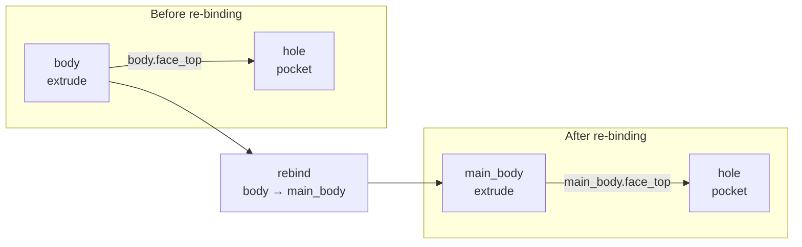
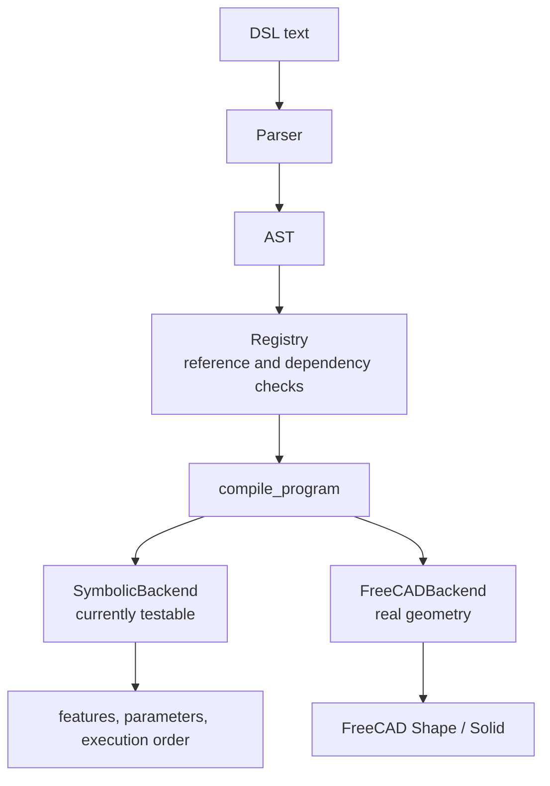

# Changelog

> Chinese version: [`CHANGELOG_8_19.md`](CHANGELOG_8_19.md)

## 2026-08-19 — M2 Reference Management and Sequential-Edit Benchmark v1

This stage advances the system from “the DSL can be parsed” to “the DSL can validate references, execute statements in order, and score sequential edit chains.” M2 W2–W4 are complete. For M2 W1, the FreeCAD compiler interface and the basic `sketch`/`extrude` path have been built, but the complete Part/PartDesign operation set has not yet been implemented. Therefore, M2 as a whole remains in progress.

## 1. Reference Registry and Dependency Graph

Rewrote `dsl/registry.py`, expanding the previous registry—which contained only a feature-name set and a TODO—into the symbolic-reference manager required for sequential editing.

- Define the derived roles exposed by each operation; for example, `extrude` provides `face_top`, `axis`, `edge_top`, and others.
- Recursively collect `Ref` objects from ordinary arguments, lists, dictionaries, and nested operations.
- Before compilation, check whether features and derived roles exist, rejecting dangling references such as `missing.face_top` and `sketch.face_top`.
- Record the dependency graph as “feature → features it depends on.”
- Compare old and new roles during `replace`; if the replacement can no longer provide a role required downstream, report a re-binding conflict.
- Implement `rebind(old, new, statements)`, updating the feature name, dependency graph, and downstream AST references together.

For example, after re-binding `body` to `main_body`, the downstream reference `body.face_top` is rewritten as `main_body.face_top`.

### Figure 1: Before and After Reference Re-binding



This figure emphasizes that the symbolic name and reference path change, while the downstream `hole` retains the same modeling intent.

## 2. Compiler Execution Framework

Implemented the execution framework in `dsl/compiler.py`. `compile_program()` now validates references in statement order, distinguishes ordinary features, `edit`, and `replace`, and then dispatches them to a backend for execution.

Two backends were added in this stage:

- `SymbolicBackend`: does not depend on FreeCAD and does not generate real 3D geometry; it stores features, parameters, and operation order for CI, reference-logic, and edit-semantics testing.
- `FreeCADBackend`: lazily imports FreeCAD/Part and creates a headless document; it currently supports circle/rectangle sketch descriptions and basic extrusion, generating cylinders and boxes respectively.

The symbolic backend has verified that `edit` changes the target parameter and that `replace` replaces the feature of the same name with a new operation. Complete FreeCAD support for `pocket`, `fillet`, `chamfer`, `pattern`, `mirror`, and feature-history rebuilding remains work for the next stage. FreeCAD is not currently installed on this machine, so real-geometry regression testing has not yet been performed.

### Figure 2: Dual-Backend Compiler Structure



The dual-backend design allows reference and edit semantics to be tested without waiting for a FreeCAD environment, while preserving a unified entry point for connection to the real CAD kernel.

## 3. Sequential-Edit Scoring Framework

Completed `score_chain()` in `eval/harness.py`, recording three results for every step in an edit chain:

| Metric | Meaning |
|---|---|
| `parse_ok` | Whether the DSL in this step can be parsed correctly |
| `refs_valid` | Whether the features and derived roles referenced in this step exist |
| `prior_preserved` | Whether features successfully created earlier are still preserved |

The scorer uses transactional state updates: a step is committed only when both parsing and reference validation pass; a failed step does not contaminate the registry used by later steps. `ref_break_rate` is calculated as “number of steps with broken references / total number of steps.”

Also added `load_chain()`, which reads a UTF-8 JSON benchmark, validates the `steps` type and declared step count, and then passes it to `score_chain()`.

### Figure 3: Failed-Step Isolation


Therefore, a single error does not invalidate all subsequent results in the benchmark.

## 4. Sequential-Edit Benchmark v1

Added three sequential-edit scenarios for shaft-type parts:

- `eval/benchmarks/chains_3step/shaft.json`: create the shaft, change its length, and drill a hole.
- `eval/benchmarks/chains_5step/shaft.json`: add a hole pattern and body replacement to the 3-step chain.
- `eval/benchmarks/chains_10step/shaft.json`: further add hole-depth editing, mirroring, constraints, pattern-count editing, and chamfering.

All three scenarios pass the smoke test, with a current symbolic-reference break rate of 0. `eval/benchmarks/README.md` was also updated with the benchmark-v1 JSON format, loading method, and step-by-step commit semantics.

## 5. DSL v1 Frozen-Spec Addendum

Added an M2 frozen-spec addendum to `dsl/grammar.md`, fixing the following execution rules:

1. References must be validated before CAD-kernel execution.
2. A feature replacement must preserve derived roles currently used downstream; otherwise, a conflict is reported.
3. Every benchmark step is atomic, and a failed step must not change later state.
4. Every step consistently reports `parse_ok`, `refs_valid`, and `prior_preserved`.

## 6. Automated Tests and Plan Updates

Added `tests/test_m2.py`, covering:

- Symbolic compilation and `edit`/`replace` semantics;
- rejection of dangling derived references;
- dependency-graph and downstream-AST re-binding;
- failed-step isolation;
- 3/5/10-step benchmark smoke tests.

The test count increased from 13 in M1 to 20:

```text
....................                                                     [100%]
20 passed in 0.06s
```

`docs/weekly_plan.md` and `docs/weekly_plan_en.md` now check off the M2 W2–W4 items that were actually completed. The complete FreeCAD compiler item and the overall M2 milestone remain unchecked.

## Current Status and Next Step

The following runnable pipeline is now available:

```text
DSL text → parser → AST → registry reference validation → symbolic compiler
                                           ↓
                              3/5/10-step sequential-edit scoring
```

The next priority is to complete `pocket`, `fillet`, `chamfer`, and related operations in the FreeCAD backend, and then run the real 3D end-to-end `sketch → extrude → pocket → fillet` example in a FreeCAD-enabled environment. After that, M2 W1 and the overall M2 milestone can be formally closed.

---

## Files Involved in This Version

- `dsl/registry.py`
- `dsl/compiler.py`
- `dsl/grammar.md`
- `eval/harness.py`
- `eval/benchmarks/README.md`
- `eval/benchmarks/chains_3step/shaft.json`
- `eval/benchmarks/chains_5step/shaft.json`
- `eval/benchmarks/chains_10step/shaft.json`
- `tests/test_m2.py`
- `docs/weekly_plan.md`
- `docs/weekly_plan_en.md`
