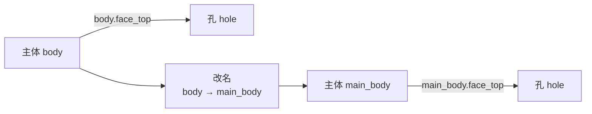
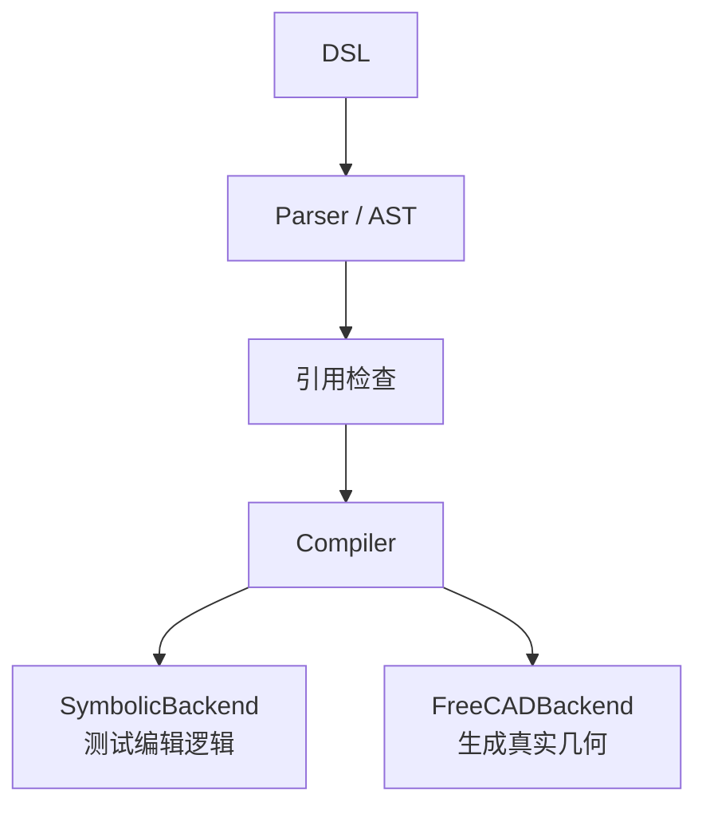

# 2026-08-19 — M2 引用管理与连续编辑基准 v1

这次把系统从“能解析 DSL”推进到“能检查引用、执行操作并评估连续编辑”。M2 W2～W4 已完成，完整 FreeCAD 编译仍在进行中。

## 1. 引用注册表与依赖图

系统现在会检查特征、面和边是否存在，并记录孔、阵列等特征依赖哪个主体。主体改名或替换时，下游引用会同步更新；缺少必要的面或边时会提前报错。



## 2. 编译器执行框架

DSL 会先经过引用检查，再由统一编译入口执行；没有 FreeCAD 时使用符号后端测试参数修改和特征替换，有 FreeCAD 时再生成真实三维模型。



目前 FreeCAD 后端支持圆形/矩形草图和基础拉伸，其他建模操作仍未完成。

## 3. 连续编辑评分框架

每一步检查 DSL 是否能解析、引用是否有效、之前的特征是否保留。失败步骤不会写入状态，因此不影响后面的编辑。


## 4. 连续编辑 benchmark v1

建立了短、中、长三组轴类零件编辑场景，目前全部通过符号测试，引用失败比例为 0。

| 场景 | 操作内容 |
|---|---|
| 3 步 | 建轴 → 修改长度 → 打孔 |
| 5 步 | 前 3 步 → 孔阵列 → 替换主体 |
| 10 步 | 前 5 步 → 改孔深 → 镜像 → 约束 → 改阵列数量 → 倒角 |

## 5. DSL v1 冻结附注

这次固定了四条规则：执行前检查引用、替换时保留下游需要的角色、失败步骤不改变后续状态、每一步统一输出三项评分。

## 6. 自动测试与计划更新

新增了编译、重绑定、失败隔离和 3/5/10 步场景测试，测试数量从 13 项增加到 20 项，全部通过。

```text
20 passed in 0.06s
```

## 当前状态与下一步

下一步补齐 FreeCAD 的 `pocket`、`fillet` 和 `chamfer`，跑通 `sketch → extrude → pocket → fillet` 后再正式完成 M2。

## 本版本涉及文件

主要修改 `dsl/registry.py`、`dsl/compiler.py`、`dsl/grammar.md`、`eval/harness.py`，并新增 benchmark 和 `tests/test_m2.py`。
