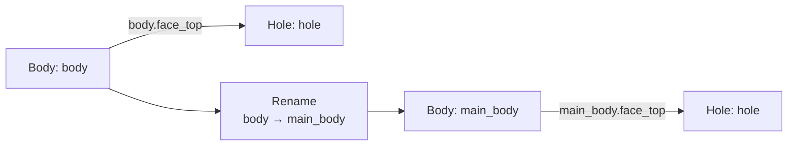
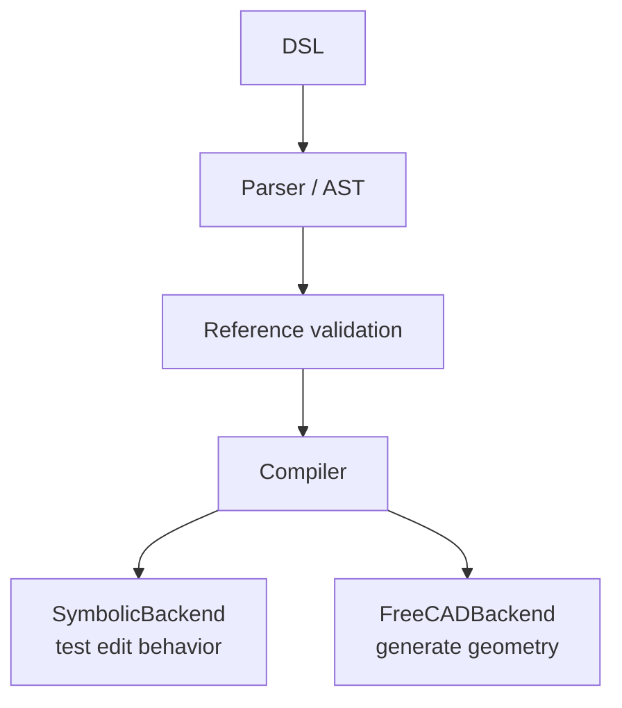

# M2 Progress Report — Reference Management & Sequential-Edit Benchmark v1

This iteration moves the system from parsing DSL to validating references, executing operations, and evaluating sequential edits. M2 W2–W4 are complete; the full FreeCAD compiler remains in progress.

## 1. Milestone status

The reference layer, symbolic compiler path, sequential scoring harness, and benchmark v1 are available. The remaining M2 work is the complete FreeCAD operation set.

## 2. Reference registry and dependency graph

The system validates features, faces, and edges and records downstream dependencies. Renaming or replacing a body updates downstream references, while missing required geometry produces an early conflict.



## 3. Compiler execution framework

DSL passes reference validation before the shared compiler runs it. SymbolicBackend tests edits without FreeCAD, while FreeCADBackend produces real geometry.



The FreeCAD backend currently supports circle/rectangle sketches and basic extrusion; the remaining modeling operations are incomplete.

## 4. Sequential-edit scoring

Each step checks parsing, reference validity, and preservation of earlier features. A failed step is not committed, so later edits continue from the last valid state.


## 5. Benchmark v1

Three short, medium, and long shaft-edit scenarios were added. All pass symbolic testing with a reference-break rate of 0.

| Scenario | Operations |
|---|---|
| 3 steps | Create shaft → change length → drill hole |
| 5 steps | First 3 → hole pattern → replace body |
| 10 steps | First 5 → edit depth → mirror → constraint → edit pattern count → chamfer |

## 6. Frozen specification and tests

The frozen rules require reference validation, role preservation during replacement, atomic benchmark steps, and the same three per-step scores. Tests increased from 13 to 20 and all pass.

```text
20 passed in 0.06s
```

## Next

Complete FreeCAD `pocket`, `fillet`, and `chamfer`, then run `sketch → extrude → pocket → fillet` before closing M2.
