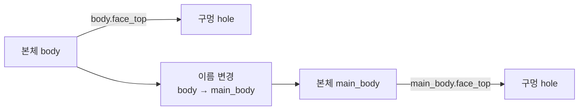
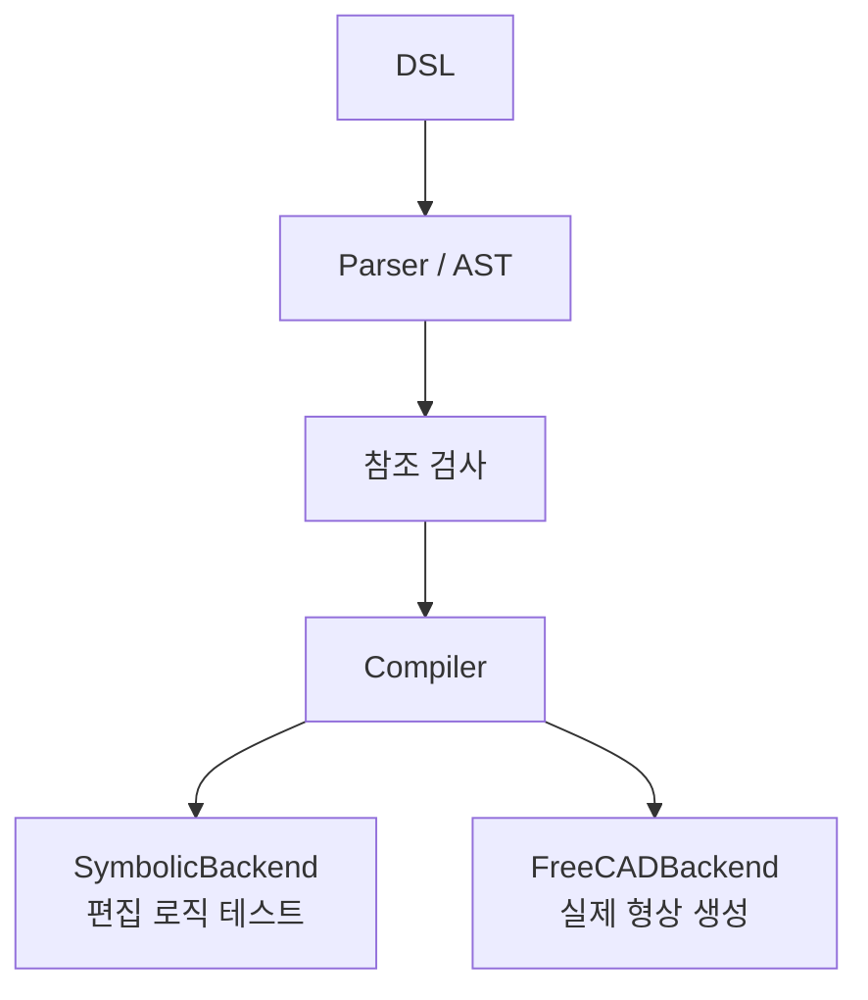

# M2 진행 보고 — 참조 관리 및 연속 편집 Benchmark v1

이번 작업을 통해 시스템은 DSL 파싱 단계에서 참조 검사, 연산 실행, 연속 편집 평가 단계로 진행했습니다. M2 W2–W4는 완료했고 전체 FreeCAD 컴파일러는 진행 중입니다.

## 1. 단계 진행 상태

참조 관리, 기호 컴파일 경로, 연속 편집 평가기, benchmark v1을 구현했습니다. M2의 남은 작업은 전체 FreeCAD 연산 구현입니다.

## 2. 참조 레지스트리와 의존 그래프

시스템은 특징, 면, 모서리의 존재를 검사하고 하위 특징의 의존 관계를 기록합니다. 본체 이름이나 형상이 바뀌면 하위 참조를 갱신하며, 필요한 요소가 없으면 실행 전에 충돌을 보고합니다.



## 3. 컴파일러 실행 프레임워크

DSL은 참조 검사를 거친 뒤 공통 컴파일러에서 실행됩니다. FreeCAD가 없을 때는 SymbolicBackend로 편집 로직을 테스트하고, FreeCADBackend에서는 실제 형상을 생성합니다.



현재 FreeCAD 백엔드는 원형/사각형 스케치와 기본 돌출을 지원하며 나머지 모델링 연산은 아직 구현 중입니다.

## 4. 연속 편집 평가

각 단계에서 DSL 파싱, 참조 유효성, 이전 특징 보존을 검사합니다. 실패한 단계는 상태에 반영되지 않으므로 이후 편집에 영향을 주지 않습니다.


## 5. Benchmark v1

짧은·중간·긴 축 편집 시나리오를 추가했습니다. 세 시나리오 모두 기호 테스트를 통과했으며 참조 실패 비율은 0입니다.

| 시나리오 | 작업 내용 |
|---|---|
| 3단계 | 축 생성 → 길이 수정 → 구멍 생성 |
| 5단계 | 앞의 3단계 → 구멍 배열 → 본체 교체 |
| 10단계 | 앞의 5단계 → 깊이 수정 → 대칭 복사 → 제약 → 배열 수 수정 → 모따기 |

## 6. 동결 규칙과 테스트

참조 사전 검사, 교체 시 역할 유지, 실패 단계 격리, 단계별 세 가지 평가 항목을 규칙으로 확정했습니다. 테스트는 13개에서 20개로 증가했고 모두 통과했습니다.

```text
20 passed in 0.06s
```

## 다음 단계

FreeCAD의 `pocket`, `fillet`, `chamfer`를 구현하고 `sketch → extrude → pocket → fillet`을 실행한 뒤 M2를 완료할 예정입니다.

## 이번 버전의 관련 파일

주요 수정 파일은 `dsl/registry.py`, `dsl/compiler.py`, `dsl/grammar.md`, `eval/harness.py`이며 benchmark와 `tests/test_m2.py`를 추가했습니다.
