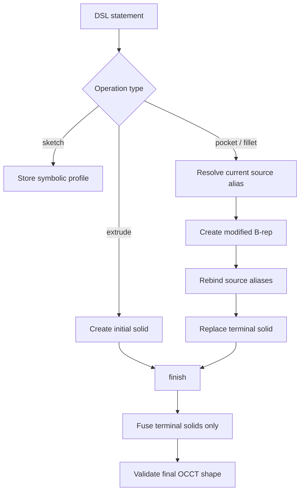
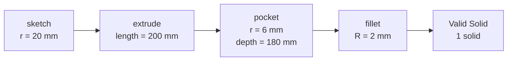
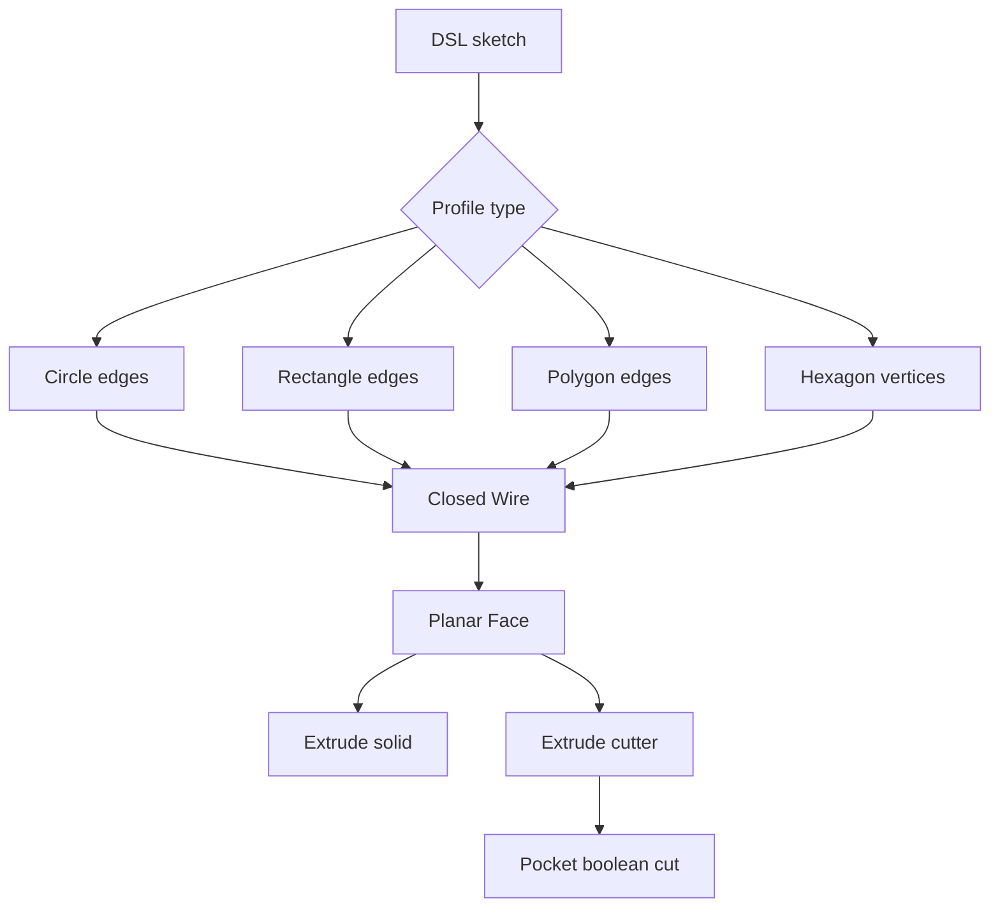

# 8 月 25 日变更日志：FreeCAD 编译链路与可视化验证

## 1. 会话信息

| 项目 | 内容 |
|---|---|
| 日期 | 2026-08-25 |
| 里程碑 | M2 — Compiler + Eval Harness v1 |
| 本次范围 | `sketch → extrude → pocket → fillet` 的真实 FreeCAD/OCCT 执行链路 |
| 运行平台 | Ubuntu 24.04、Python 3.11、FreeCAD 1.1.3 |
| 最终验证 | 203 项测试通过，Ruff 通过，Python 依赖检查通过 |

## 2. 执行摘要

本次工作将 DSL 规范 §3 的轴类零件示例从“能够解析 AST”推进到“能够在真实 FreeCAD/OCCT
几何内核中生成、切削、圆角并验证实体”。新增了圆形轴向 `pocket` 和顶部外缘 `fillet`，并修复了
modifier 特征与旧实体同时参与最终融合的问题。

为避免只凭测试终端文字判断结果，本次还增加了可重复生成的 HTML 可视化测试报告。报告直接执行
真实 pytest 用例，展示实际测试源码、pytest 输出、三个建模阶段的整体视图、顶部放大图、纵向剖视图、
体积、实体数量和最优包围盒，并导出可独立检查的 STL 文件。

完成主要功能后，又针对代码进行自检并修复了五类正确性问题：错误单位被静默接受、未知操作进入评估、
重复参数覆盖、literal root 派生引用绕过校验，以及 backend 重用时遗留 FreeCAD 文档对象。同时补充了
Linux 可复现环境、依赖分层、编译器状态文档和生成物管理规则。

## 3. 变更背景

变更前，`FreeCADBackend` 已支持圆形/矩形 `sketch` 和 `extrude`，但 DSL §3 示例中的后两步仍会返回：

```text
FreeCAD backend operation not implemented: pocket
FreeCAD backend operation not implemented: fillet
```

原有 `finish()` 会融合 `objects` 中的所有实体。如果直接把 pocket 或 fillet 结果作为新对象加入，旧 body
也会参与融合，导致被切除的孔重新被旧实体填回。因此，本次实现不能只增加两个几何 API 调用，还需要定义
modifier 特征替换当前 terminal solid 的状态语义。

## 4. FreeCAD 后端实现

### 4.1 Terminal solid 跟踪

在 `FreeCADBackend` 中新增 `active_solids`：

- `objects` 保存 DSL 名称到当前 FreeCAD 对象的解析别名；
- `active_solids` 只保存最终应参与 `finish()` 的 terminal solids；
- pocket/fillet 生成后，将输入实体从 `active_solids` 移除；
- 原始名称（例如 `body`）重新指向最新特征，以便后续 `body.edge_top` 继续解析；
- `finish()` 只融合 terminal solids，不再融合已被后续特征取代的历史形状。



### 4.2 Circular pocket

本次实现的 pocket 范围为：

| 参数 | 当前语义 |
|---|---|
| `on` | `<feature>.face_top` |
| profile | 内联 `circle=[center=..., r=...]` |
| `center` | `origin` 或目标实体的 `<feature>.axis` |
| `depth` | 从顶部沿实体轴负方向切削的正毫米值 |

执行过程：

1. 解析 `on=body.face_top` 并取得 body 当前对应的实体；
2. 根据 body 轴向与顶点投影计算顶部中心；
3. 使用 `Part.makeCylinder()` 创建反向圆柱刀具体；
4. 通过 `source.Shape.cut(cutter)` 执行布尔差；
5. 将仅包含一个 Solid 的 Compound 规范化为单一 Solid；
6. 更新 terminal solid 与 DSL 名称别名。

### 4.3 Outer top-edge fillet

本次实现的 fillet 范围为：

| 参数 | 当前语义 |
|---|---|
| `on` | `<feature>.edge_top` |
| `radius` | 正毫米值 |
| edge 选择 | 轴向投影位于顶部的候选边中，选择长度最大的外缘 |

在 pocket 后的圆柱顶部同时存在外圆边和孔口内圆边。稳定角色 `body.edge_top` 在当前实现中表示外缘，
因此通过候选边长度区分外圆边与孔口边，再调用 `Shape.makeFillet()`。

### 4.4 §3 几何结果

输入 DSL：

```dsl
sk1 = sketch(plane=XY, circle=[center=origin, r=20]);
body = extrude(profile=sk1, length=200);
hole1 = pocket(on=body.face_top, circle=[center=body.axis, r=6], depth=180);
edge1 = fillet(on=body.edge_top, radius=2);
```

真实 OCCT 结果：

| 阶段 | ShapeType | Solids | Volume (mm³) | Optimal bounds (mm) |
|---|---:|---:|---:|---:|
| Extrude | Solid | 1 | 251327.412 | 40 × 40 × 200 |
| Pocket | Solid | 1 | 230969.892 | 40 × 40 × 200 |
| Fillet | Solid | 1 | 230864.431 | 40 × 40 × 200 |

Pocket 移除体积与理论值 `π × 6² × 180` 一致。Fillet 后实体仍为单一、有效 Solid，体积小于 pocket 阶段。



## 5. 正确性与鲁棒性修复

### 5.1 单位类型校验

此前 `_number()` 只读取 `Quantity.value`，会把 `10 deg` 静默当作 10 mm。现在所有已实现的线性尺寸只接受：

- 无单位数值（DSL 默认毫米）；
- 显式 `mm`。

对 radius、length、depth 使用 `deg` 会抛出 `CompileError`，避免错误尺寸进入几何内核。

### 5.2 合法操作闭集

新增 `KNOWN_OPERATIONS`，覆盖冻结 DSL §4、assembly addendum 和 §7 使用的 `hex(...)` profile constructor。
拼写错误或不存在的操作（如 `widget()`）现在在解析层失败，不再被 SymbolicBackend 接受，也不会被
`score_chain()` 计为 parse/reference 均成功。

### 5.3 重复参数与标识符校验

- `sketch(plane=XY, plane=YZ)` 现在报告 duplicate argument；
- 标识符严格遵循 `[A-Za-z_][A-Za-z0-9_]*`；
- 不再使用正则 `\w` 接受规范外的 Unicode 标识符。

### 5.4 Literal reference 校验

此前 registry 遇到 `XY`、`origin` 等 literal root 会立即跳过其余路径，导致 `XY.axis` 被错误接受。
现在 literal 只能作为单段、无 index 的引用，派生或索引形式会报告 `ReferenceError`。

### 5.5 Backend reset 清理

modifier 操作会在 FreeCAD 文档中保留历史对象，但更新别名后旧对象不再出现在 `objects` 中。原 reset
只遍历 `objects`，因此 backend 重用后会残留对象。现在 reset 遍历 backend 自有 document 的全部对象，
确保批量编译和 self-repair 循环不会持续积累历史对象。

## 6. HTML 可视化测试报告

新增 `scripts/render_section3_report.py`，运行命令：

```bash
.venv/bin/python scripts/render_section3_report.py
```

报告输出至本地 `artifacts/section3_visual/`，包含：

- 三个阶段的完整模型图；
- 顶部 32 mm 放大图；
- 纵向剖视图；
- ShapeType、valid、solid 数量、体积与 optimal bounds；
- 实际执行的两个 pytest 函数源码；
- pytest 原始输出；
- 每个阶段的 STL 文件。

报告中的测试源码通过 Python AST 从 `tests/test_kernel_geometry.py` 直接提取，不再维护容易漂移的手写副本。
PNG/STL/HTML 属于可重复生成物，已从 Git 跟踪中移除并加入 `.gitignore`，本地文件仍可正常使用。

## 7. 测试补充与验证结果

新增或加强的测试覆盖：

| 类别 | 覆盖内容 |
|---|---|
| Geometry | pocket 理论切削体积 |
| Geometry | pocket 后执行 fillet，结果为单一有效 Solid |
| Geometry | fillet 后 `optimalBoundingBox()` 为 40 × 40 × 200 mm |
| Units | radius/length/depth 的 `deg` 错误单位被拒绝 |
| Parser | 未知 operation 被拒绝 |
| Parser | duplicate argument 被拒绝 |
| Parser | 非 ASCII identifier 被拒绝 |
| Registry | `XY.axis` 等 literal 派生引用被拒绝 |
| Metrics | 未知 operation 在 chain scoring 中计为 parse failure |
| Lifecycle | pocket/fillet 历史对象在 reset 后全部清除 |

最终验证：

```text
203 passed in 0.90s
All checks passed!             # Ruff
No broken requirements found. # pip check
```

## 8. 环境与依赖补充

新增 Linux 可复现环境文件：

- `environment.yml`：Python 3.11、FreeCAD 1.1、CAD 开发与测试依赖；
- `requirements-cad.txt`：DSL、测试、几何评估、HTML 渲染依赖；
- `requirements-training.txt`：torch、transformers、PEFT、bitsandbytes 等 GPU 训练依赖；
- `requirements.txt`：完整环境聚合入口。

Linux 创建环境：

```bash
micromamba create -y -p "$PWD/.venv" -f environment.yml
echo "$PWD/.venv/lib" > .venv/lib/python3.11/site-packages/freecad.pth
```

README 和 `docs/visual_test_guide.md` 已同步更新。

## 9. 文件级变更清单

| 文件 | 变更 |
|---|---|
| `dsl/compiler.py` | pocket、fillet、terminal solid、单位校验、reset 清理 |
| `dsl/ast.py` | 合法 operation 闭集 |
| `dsl/parser.py` | ASCII identifier、duplicate argument 校验 |
| `dsl/registry.py` | literal reference 严格校验 |
| `tests/test_kernel_geometry.py` | §3 几何、optimal bounds、生命周期测试 |
| `tests/test_kernel_errors.py` | 线性尺寸错误单位测试 |
| `tests/test_dsl_parser.py` | operation、参数、identifier 测试 |
| `tests/test_m2.py` | registry 与 chain scoring 回归测试 |
| `scripts/render_section3_report.py` | HTML/PNG/STL 可视化测试生成器 |
| `docs/visual_test_guide.md` | 英文运行与故障排查指南 |
| `docs/compiler_status.md` | 当前实现范围、限制与后续任务 |
| `environment.yml` | Linux conda-forge 环境定义 |
| `requirements-*.txt` | CAD 与训练依赖分层 |
| `docs/weekly_plan*.md` | 将完成状态修正为 §3 subset，列出剩余 §4 操作 |

## 10. 已知限制与风险

1. `face_top` / `edge_top` 仍通过轴向极值推断，尚未形成通用 role-to-subshape resolver。
2. Pocket 仅支持轴向圆形 profile，不支持任意 sketch、离轴位置或复杂目标面。
3. Fillet 对多条等价顶部边的通用稳定选择尚未完成。
4. 普通 `Shape.BoundBox` 在 fillet 后可能保守报告约 43.296 mm；尺寸验证必须使用
   `Shape.optimalBoundingBox()` 或解析几何测量。
5. 当前使用 Part B-rep 运算并存入 `PartDesign::Feature`，还不具备原生参数化 PartDesign history。
6. `revolve/chamfer/groove/edit/replace/pattern/mirror/constraint` 和 polygon sketch 尚未实现。
7. `verify/kernel.py`、尺寸规则、IoU 和 self-repair pipeline 仍处于后续里程碑。

## 11. 下一步计划

后续首先增加统一的二维 Profile 编译层，消除当前 circle/rectangle 对 FreeCAD primitive 的硬编码。

当前实现是按图形类型直接选择 primitive：

```text
DSL sketch
   ├── circle → Part.makeCylinder()
   └── rect   → Part.makeBox()
```

这种方式可以快速生成圆柱和长方体，但每增加一种图形都需要在 extrude/pocket 中增加新的特殊分支，
profile 校验、平面变换和后续稳定引用也难以复用。

目标结构是先把所有二维图形规范化为同一种拓扑 Profile：

```text
DSL sketch
   ↓
ProfileSpec
   ↓
FreeCAD Edge collection
   ↓
Closed Wire
   ↓
Planar Face
   ├── extrude → Solid
   └── pocket  → Cutter → Boolean cut
```

这条流程可以简单理解为“描述图形 → 画出边线 → 闭合轮廓 → 填成平面 → 拉伸或切除”：

| 阶段 | 简单理解 | 实际作用 |
|---|---|---|
| DSL sketch | 用户写下想画的二维图形 | 提供平面、类型、尺寸和参考位置 |
| ProfileSpec | 把不同写法整理成统一的图形说明卡 | 统一 circle/rect/polygon/hex、单位和坐标系 |
| Edge collection | 画出组成轮廓的线或圆弧 | Rectangle 是 4 条线，hex 是 6 条线，circle 是 1 条闭合圆边 |
| Closed Wire | 把所有边首尾连接成封闭线框 | 检查断口、重复点、零面积和自相交 |
| Planar Face | 给封闭线框填充一个有面积的平面 | 得到可以执行三维操作的二维 Face |
| Extrude | 沿一个方向把 Face 拉高 | 生成真正的三维 Solid |
| Pocket | 把 Face 拉伸成刀具体，再从原 Solid 中减掉 | 生成孔、槽或其他切除结构 |

例如矩形不再直接调用 `makeBox()`，而是执行：

```text
4 rectangle edges → closed rectangle Wire → filled Face
                                              ├── pull upward → box-like Solid
                                              └── pull downward → Cutter → pocket
```

这样增加 polygon 或 hex 时，只需要增加“如何生成 Edge”，后面的 Wire、Face、extrude 和 pocket
可以全部复用。



具体改进方式：

1. 将 circle、rectangle、polygon 和 hex 统一转换为 FreeCAD `Edge → Wire → Face`；
2. Extrude 改为对通用 Face 执行 `Face.extrude()`，不再分别调用 cylinder/box primitive；
3. Pocket 复用同一个 Profile 编译器，将 Face 拉伸成 cutter 后执行布尔差；
4. 增加 polygon 闭合、重复点、零面积和自相交检查，并定义完整参数/单位 schema；
5. 建立 symbolic role → FreeCAD subshape resolver，稳定解析 `face_top`、`edge_top` 和 `wall`；
6. 在此基础上继续实现 edit/replace history rebuild、chamfer、revolve、pattern、mirror 和
   `verify/kernel.py`，并增加非 XY 平面及连续 modifier 的真实内核测试。
