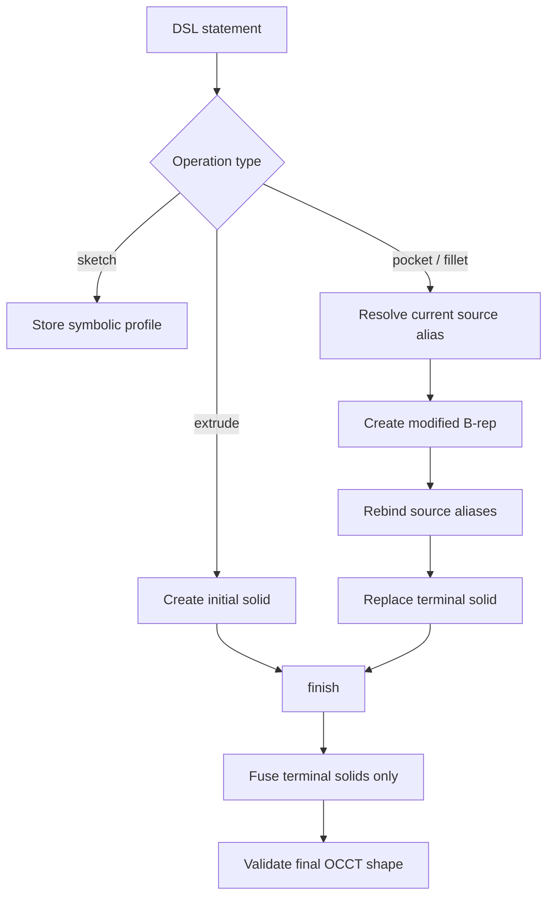
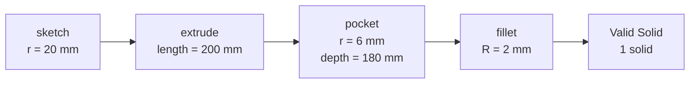
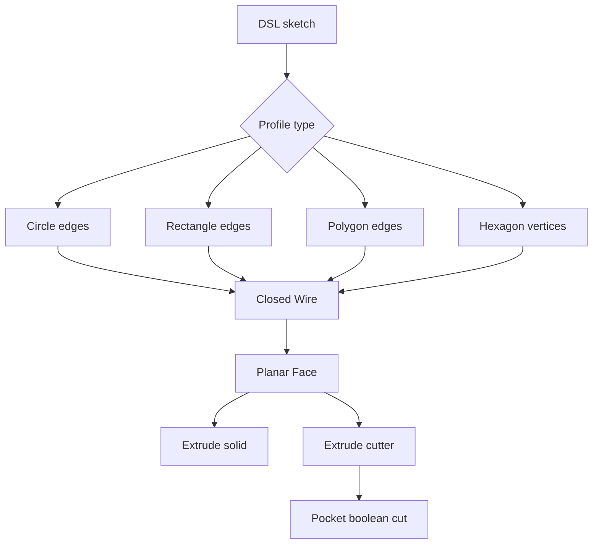

# August 25 Changelog: FreeCAD Compilation and Visual Verification

## 1. Session Information

| Item | Value |
|---|---|
| Date | 2026-08-25 |
| Milestone | M2 — Compiler + Eval Harness v1 |
| Scope | Real FreeCAD/OCCT execution for `sketch → extrude → pocket → fillet` |
| Platform | Ubuntu 24.04, Python 3.11, FreeCAD 1.1.3 |
| Final verification | 203 tests passed, Ruff passed, Python dependency check passed |

## 2. Executive Summary

This session advanced the grammar.md §3 shaft example from a parsed AST to a real, validated
FreeCAD/OCCT solid. The backend now supports circular axial pockets and outer top-edge fillets. It
also tracks terminal solids so superseded feature shapes are not fused back into the final model.

A reproducible HTML visual test report was added so kernel execution can be inspected rather than
trusted from terminal output alone. The report runs the real pytest cases and displays their exact
source, pytest output, full models, enlarged top views, longitudinal sections, volumes, solid counts,
optimal bounds, and independently inspectable STL exports.

A follow-up audit found and corrected five correctness issues: angular units accepted as linear
dimensions, unknown operations entering evaluation, duplicate arguments overwriting earlier values,
malformed literal-derived references bypassing validation, and superseded FreeCAD document objects
surviving backend reset. Linux environment reproduction, dependency separation, compiler status
documentation, and generated-artifact policy were also added.

## 3. Previous State and Motivation

Before this change, `FreeCADBackend` supported circle/rectangle sketches and extrusion, but the final
two operations in the §3 example raised explicit not-implemented errors for `pocket` and `fillet`.

Simply adding the modified shapes to the existing object map was insufficient. The old `finish()`
fused every shaped object, which would fuse the original body back into a pocket result and refill
the removed material. Modifier features therefore required explicit terminal-solid semantics.

## 4. FreeCAD Backend Implementation

### 4.1 Terminal-solid tracking

`FreeCADBackend.active_solids` now distinguishes final model tips from name-resolution aliases:

- `objects` maps DSL names to their current FreeCAD objects;
- `active_solids` contains only the terminal shapes that belong in `finish()`;
- pocket/fillet remove their input from the active set;
- source aliases such as `body` are redirected to the new feature;
- `finish()` fuses terminal solids only.



### 4.2 Circular pocket

The implemented subset accepts `on=<feature>.face_top`, an inline circular profile centered on
`origin` or `<feature>.axis`, and a positive millimetre depth. The backend finds the top along the
feature axis, creates a reverse cylinder cutter with `Part.makeCylinder()`, performs a boolean cut,
normalizes a one-solid Compound into a Solid, and replaces the active model tip.

### 4.3 Outer top-edge fillet

The implemented subset accepts `on=<feature>.edge_top` and a positive millimetre radius. A pocketed
cylinder has both an outer top rim and an inner hole rim. Candidates are selected at the maximum axis
projection and the longest candidate is treated as the stable outer `edge_top` role before calling
`Shape.makeFillet()`.

### 4.4 §3 kernel result

```dsl
sk1 = sketch(plane=XY, circle=[center=origin, r=20]);
body = extrude(profile=sk1, length=200);
hole1 = pocket(on=body.face_top, circle=[center=body.axis, r=6], depth=180);
edge1 = fillet(on=body.edge_top, radius=2);
```

| Stage | ShapeType | Solids | Volume (mm³) | Optimal bounds (mm) |
|---|---:|---:|---:|---:|
| Extrude | Solid | 1 | 251327.412 | 40 × 40 × 200 |
| Pocket | Solid | 1 | 230969.892 | 40 × 40 × 200 |
| Fillet | Solid | 1 | 230864.431 | 40 × 40 × 200 |

The pocket volume change matches `π × 6² × 180`. The filleted result remains one valid Solid and has
less volume than the pocketed model.



## 5. Correctness and Robustness Fixes

### Unit typing

Linear dimensions now accept bare values or `mm` only. Supplying `deg` for radius, length, or depth
raises `CompileError` rather than silently treating the magnitude as millimetres.

### Closed operation set

`KNOWN_OPERATIONS` covers frozen DSL §4, the assembly addendum, and the `hex(...)` constructor used
by §7. Unknown operations now fail parsing and no longer inflate symbolic parse/reference metrics.

### Duplicate arguments and identifiers

Duplicate arguments are rejected instead of overwriting earlier values. Identifiers now follow the
exact frozen ASCII rule `[A-Za-z_][A-Za-z0-9_]*` rather than the broader Unicode `\w` class.

### Literal references

Literal roots such as `XY` and `origin` must be single-segment, unindexed references. Malformed forms
such as `XY.axis` now raise `ReferenceError`.

### Backend reset

Reset now clears every object in the backend-owned FreeCAD document, including superseded modifier
history objects no longer reachable through `objects`. This prevents accumulation during batch
compilation and self-repair loops.

## 6. Visual Test Report

Run:

```bash
.venv/bin/python scripts/render_section3_report.py
```

The local `artifacts/section3_visual/` report contains:

- full-model images for extrude, pocket, and fillet;
- enlarged views of the top 32 mm;
- longitudinal sections;
- ShapeType, validity, solid count, volume, and optimal bounds;
- the exact two pytest functions executed by the report;
- raw pytest output;
- an STL export for every stage.

The displayed test source is extracted directly from `tests/test_kernel_geometry.py` through Python's
AST, eliminating the previous manually duplicated snippet. Generated HTML/PNG/STL files are ignored
by Git and can be recreated from the script at any time.

## 7. Test Coverage and Verification

| Category | Added coverage |
|---|---|
| Geometry | Theoretical circular pocket removal volume |
| Geometry | Fillet after pocket produces one valid Solid |
| Geometry | Fillet optimal bounds remain 40 × 40 × 200 mm |
| Units | Reject `deg` for radius, length, and depth |
| Parser | Reject unknown operations |
| Parser | Reject duplicate arguments |
| Parser | Reject non-ASCII identifiers |
| Registry | Reject literal-derived references such as `XY.axis` |
| Metrics | Count unknown operations as chain parse failures |
| Lifecycle | Clear pocket/fillet history during backend reset |

Final checks:

```text
203 passed in 0.90s
All checks passed!             # Ruff
No broken requirements found. # pip check
```

## 8. Environment and Dependency Changes

- `environment.yml` defines the Linux Python 3.11 / FreeCAD 1.1 CAD environment.
- `requirements-cad.txt` contains DSL, test, geometry, and visual-report dependencies.
- `requirements-training.txt` contains the GPU training stack.
- `requirements.txt` remains the complete aggregate environment.

Linux setup:

```bash
micromamba create -y -p "$PWD/.venv" -f environment.yml
echo "$PWD/.venv/lib" > .venv/lib/python3.11/site-packages/freecad.pth
```

README and `docs/visual_test_guide.md` now document this workflow.

## 9. File-level Change Summary

| File | Change |
|---|---|
| `dsl/compiler.py` | Pocket, fillet, terminal solids, unit typing, reset cleanup |
| `dsl/ast.py` | Closed operation set |
| `dsl/parser.py` | ASCII identifiers and duplicate-argument validation |
| `dsl/registry.py` | Strict literal-reference validation |
| `tests/test_kernel_geometry.py` | §3 geometry, optimal bounds, lifecycle tests |
| `tests/test_kernel_errors.py` | Wrong-unit kernel tests |
| `tests/test_dsl_parser.py` | Operation, argument, and identifier tests |
| `tests/test_m2.py` | Registry and chain-scoring regressions |
| `scripts/render_section3_report.py` | HTML/PNG/STL visual test generator |
| `docs/visual_test_guide.md` | English usage and troubleshooting guide |
| `docs/compiler_status.md` | Implemented scope, limitations, and next work |
| `environment.yml` | Linux conda-forge environment |
| `requirements-*.txt` | Separated CAD and training dependencies |
| `docs/weekly_plan*.md` | Corrected completion scope and remaining operations |

## 10. Known Limitations and Risks

1. `face_top` and `edge_top` still use geometric axis/extrema heuristics rather than a general
   role-to-subshape resolver.
2. Pocket supports only an axial inline circle, not arbitrary sketches or off-axis placement.
3. General stable selection among multiple equivalent top edges is not implemented.
4. Ordinary `Shape.BoundBox` can conservatively report about 43.296 mm after filleting this 40 mm
   shaft; verification must use `Shape.optimalBoundingBox()` or analytic measurements.
5. B-reps are stored in `PartDesign::Feature`, but native parametric PartDesign history is not built.
6. `revolve/chamfer/groove/edit/replace/pattern/mirror/constraint` and polygon sketches remain pending.
7. Kernel verification, dimension rules, IoU, and self-repair are future milestone work.

## 11. Next Work

The next compiler step is a unified 2D Profile layer that removes the current hard-coded mapping from
circle/rectangle profiles to FreeCAD primitives.



Planned improvements:

1. Convert circle, rectangle, polygon, and hex profiles through one FreeCAD `Edge → Wire → Face`
   pipeline.
2. Extrude a general Face with `Face.extrude()` instead of selecting cylinder/box primitives.
3. Reuse the same Profile compiler for pocket cutters before performing the boolean difference.
4. Validate polygon closure, duplicate points, zero area, and self-intersection, with complete argument
   and unit schemas.
5. Add a symbolic-role to FreeCAD-subshape resolver for stable `face_top`, `edge_top`, and `wall`
   bindings.
6. Build edit/replace history rebuild, chamfer, revolve, pattern, mirror, and `verify/kernel.py` on this
   layer, with real-kernel tests for non-XY planes and chained modifiers.
