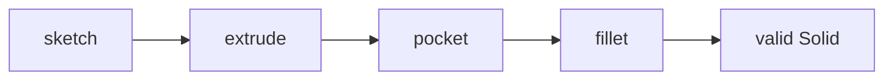

# August 25 Changelog

- Implemented circular `pocket` and outer top-edge `fillet` in the FreeCAD backend.
- Added terminal-solid tracking so superseded feature shapes are not fused back into the result.
- Verified the complete §3 example with the real OCCT kernel; all 191 tests pass.
- Added a reproducible HTML, PNG, and STL visual verification report.

