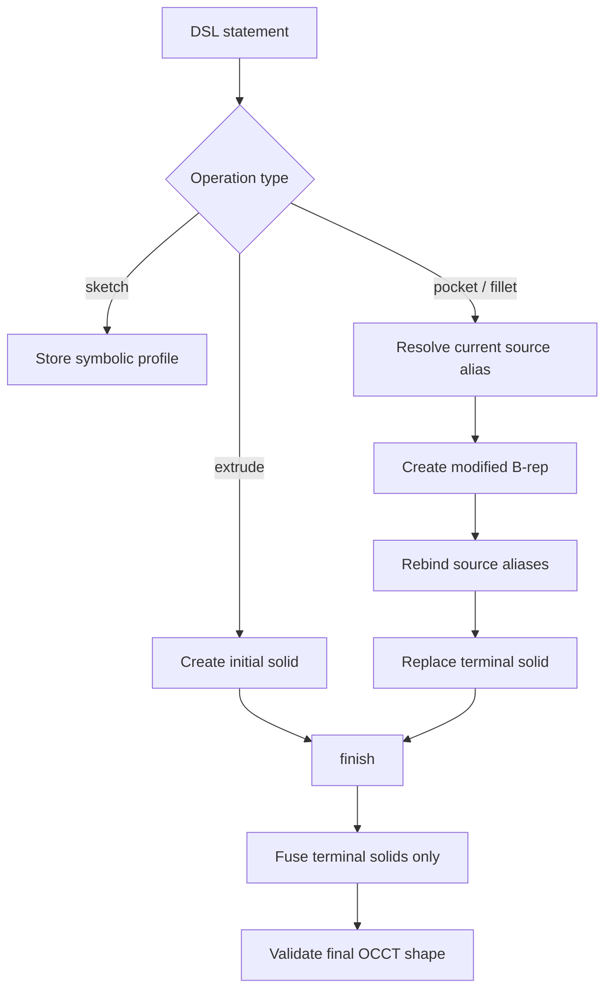
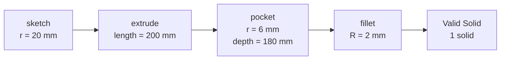
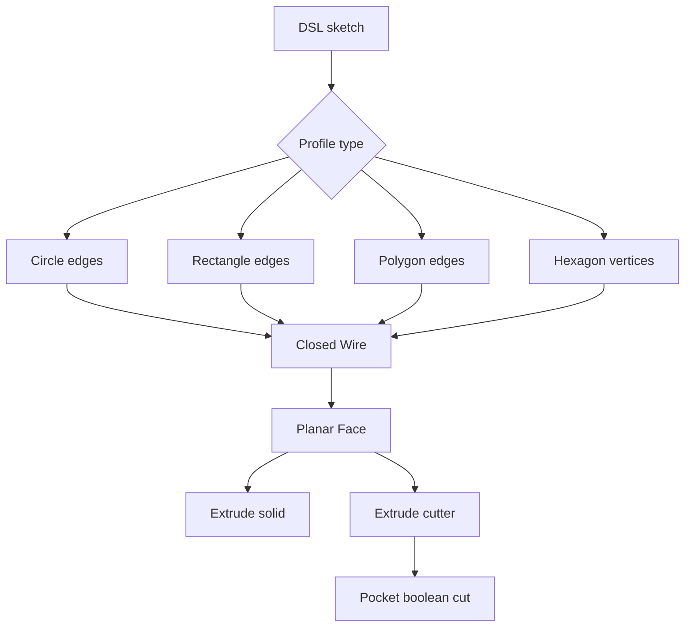

# 8월 25일 변경 로그: FreeCAD 컴파일 파이프라인 및 시각적 검증

## 1. 세션 정보

| 항목 | 내용 |
|---|---|
| 날짜 | 2026-08-25 |
| 마일스톤 | M2 — Compiler + Eval Harness v1 |
| 작업 범위 | `sketch → extrude → pocket → fillet`의 실제 FreeCAD/OCCT 실행 파이프라인 |
| 실행 환경 | Ubuntu 24.04, Python 3.11, FreeCAD 1.1.3 |
| 최종 검증 | 테스트 203개 통과, Ruff 통과, Python 의존성 검사 통과 |

## 2. 실행 요약

이번 작업에서는 grammar.md §3의 축 부품 예제를 단순히 AST로 파싱하는 단계에서 실제 FreeCAD/OCCT
솔리드를 생성하고 검증하는 단계까지 확장했다. FreeCAD backend에 원형 축 방향 `pocket`과 외측 상단
모서리 `fillet`을 추가했으며, 이전 feature shape가 최종 결과에 다시 fuse되는 문제를 방지하기 위해
terminal solid 추적 기능을 도입했다.

터미널의 테스트 성공 메시지만으로 결과를 판단하지 않도록 재현 가능한 HTML 시각적 테스트 리포트도
추가했다. 리포트는 실제 pytest 테스트를 실행하고, 테스트 원본 코드와 출력, 전체 모델, 상단 확대 뷰,
세로 단면, 부피, solid 수, optimal bounding box 및 독립적으로 확인할 수 있는 STL 파일을 제공한다.

기능 구현 이후 자체 점검을 수행하여 다음 다섯 가지 정확성 문제를 수정했다. 각도 단위가 선형 치수로
허용되던 문제, 알 수 없는 operation이 평가에 포함되던 문제, 중복 인자가 이전 값을 덮어쓰던 문제,
잘못된 literal 파생 reference가 검증을 우회하던 문제, backend reset 이후 이전 FreeCAD document object가
남아 있던 문제를 해결했다. 또한 Linux 재현 환경, CAD/학습 의존성 분리, compiler 상태 문서 및 생성물
관리 정책을 추가했다.

## 3. 변경 배경

변경 전 `FreeCADBackend`는 원형/직사각형 `sketch`와 `extrude`를 지원했지만, §3 예제의 마지막 두
operation은 다음 오류를 반환했다.

```text
FreeCAD backend operation not implemented: pocket
FreeCAD backend operation not implemented: fillet
```

기존 `finish()`는 shape를 가진 모든 object를 fuse했다. Pocket 또는 fillet 결과를 새로운 object로 단순히
추가하면 원본 body가 pocket 결과와 다시 fuse되어 제거된 재료가 채워진다. 따라서 두 개의 geometry API만
추가하는 것으로는 충분하지 않았으며, modifier feature가 현재 terminal solid를 대체하는 상태 의미론이
필요했다.

## 4. FreeCAD Backend 구현

### 4.1 Terminal solid 추적

`FreeCADBackend.active_solids`를 추가하여 DSL 이름 해석과 최종 모델 구성을 분리했다.

- `objects`는 DSL 이름을 현재 FreeCAD object에 매핑한다.
- `active_solids`는 `finish()`에 포함해야 하는 terminal shape만 보관한다.
- Pocket/fillet 실행 후 입력 solid를 active set에서 제거한다.
- `body`와 같은 원래 이름은 최신 feature를 가리키도록 다시 연결한다.
- `finish()`는 terminal solid만 fuse한다.



### 4.2 원형 Pocket

현재 구현된 pocket 범위는 다음과 같다.

| 인자 | 현재 의미 |
|---|---|
| `on` | `<feature>.face_top` |
| profile | inline `circle=[center=..., r=...]` |
| `center` | `origin` 또는 대상 solid의 `<feature>.axis` |
| `depth` | 상단에서 solid 축의 반대 방향으로 절삭하는 양의 mm 값 |

실행 절차:

1. `on=body.face_top`을 해석하고 body가 현재 가리키는 solid를 가져온다.
2. Body axis와 vertex projection을 이용해 상단 중심을 계산한다.
3. `Part.makeCylinder()`로 반대 방향의 원통형 cutter를 생성한다.
4. `source.Shape.cut(cutter)`로 boolean difference를 수행한다.
5. 하나의 Solid만 포함한 Compound를 단일 Solid로 정규화한다.
6. Terminal solid와 DSL 이름 alias를 갱신한다.

### 4.3 외측 상단 모서리 Fillet

현재 구현된 fillet 범위는 다음과 같다.

| 인자 | 현재 의미 |
|---|---|
| `on` | `<feature>.edge_top` |
| `radius` | 양의 mm 값 |
| edge 선택 | 축 방향 projection이 가장 높은 후보 중 길이가 가장 긴 외측 edge |

Pocket 처리된 원통 상단에는 외측 원형 edge와 구멍 입구의 내측 원형 edge가 함께 존재한다. 현재 안정
역할 `body.edge_top`은 외측 edge를 의미하므로, 상단 후보 중 길이가 가장 긴 edge를 선택한 뒤
`Shape.makeFillet()`을 호출한다.

### 4.4 §3 Geometry 결과

입력 DSL:

```dsl
sk1 = sketch(plane=XY, circle=[center=origin, r=20]);
body = extrude(profile=sk1, length=200);
hole1 = pocket(on=body.face_top, circle=[center=body.axis, r=6], depth=180);
edge1 = fillet(on=body.edge_top, radius=2);
```

실제 OCCT 결과:

| 단계 | ShapeType | Solids | Volume (mm³) | Optimal bounds (mm) |
|---|---:|---:|---:|---:|
| Extrude | Solid | 1 | 251327.412 | 40 × 40 × 200 |
| Pocket | Solid | 1 | 230969.892 | 40 × 40 × 200 |
| Fillet | Solid | 1 | 230864.431 | 40 × 40 × 200 |

Pocket으로 제거된 부피는 이론값 `π × 6² × 180`과 일치한다. Fillet 결과는 하나의 유효한 Solid이며
pocket 단계보다 작은 부피를 가진다.



## 5. 정확성 및 견고성 개선

### 5.1 단위 타입 검증

기존 `_number()`는 `Quantity.value`만 사용했기 때문에 `10 deg`를 10 mm로 처리할 수 있었다. 현재
구현된 모든 선형 치수는 단위가 없는 값 또는 명시적인 `mm`만 허용한다. Radius, length 또는 depth에
`deg`를 사용하면 geometry kernel 실행 전에 `CompileError`가 발생한다.

### 5.2 허용 Operation 폐쇄 집합

`KNOWN_OPERATIONS`를 추가하여 frozen DSL §4, assembly addendum 및 §7의 `hex(...)` constructor를
명시했다. `widget()`과 같은 알 수 없는 operation은 parser 단계에서 거부되며 SymbolicBackend 또는
`score_chain()`의 parse/reference 성공 통계를 잘못 높이지 않는다.

### 5.3 중복 인자 및 Identifier 검증

- `sketch(plane=XY, plane=YZ)`와 같은 중복 인자를 거부한다.
- Identifier는 `[A-Za-z_][A-Za-z0-9_]*` 규칙을 정확히 따른다.
- 정규식 `\w`가 grammar 범위 밖의 Unicode identifier를 허용하던 문제를 제거했다.

### 5.4 Literal Reference 검증

이전 registry는 `XY`, `origin` 등의 literal root를 만나면 남은 path를 확인하지 않아 `XY.axis`가 허용될
수 있었다. 이제 literal은 index가 없는 단일 path로만 사용할 수 있으며 파생 또는 indexed 형식은
`ReferenceError`를 발생시킨다.

### 5.5 Backend Reset 정리

Modifier operation은 FreeCAD document에 history object를 남긴다. Alias 갱신 후 이전 object는
`objects`에서 접근할 수 없으므로 기존 reset 방식으로 제거되지 않았다. 현재 reset은 backend가 소유한
document의 모든 object를 순회하여 제거하며, batch compilation과 self-repair loop에서 object가 계속
누적되는 문제를 방지한다.

## 6. HTML 시각적 테스트 리포트

실행 명령:

```bash
.venv/bin/python scripts/render_section3_report.py
```

로컬 `artifacts/section3_visual/`에 다음 결과가 생성된다.

- Extrude, pocket, fillet 각 단계의 전체 모델 이미지
- 상단 32 mm 확대 이미지
- 세로 단면 이미지
- ShapeType, validity, solid 수, volume 및 optimal bounds
- 리포트가 실제 실행하는 두 pytest 함수의 원본 코드
- pytest 원본 출력
- 각 단계의 STL 파일

표시되는 테스트 코드는 Python AST를 사용하여 `tests/test_kernel_geometry.py`에서 직접 추출한다. 따라서
수동으로 작성한 테스트 예제가 실제 테스트와 달라지는 문제를 방지한다. 생성된 HTML/PNG/STL은 Git에서
제외되며 스크립트로 언제든지 다시 만들 수 있다.

## 7. 테스트 범위 및 검증 결과

| 분류 | 추가된 검증 |
|---|---|
| Geometry | 원형 pocket의 이론적 제거 부피 |
| Geometry | Pocket 이후 fillet 결과가 하나의 유효한 Solid인지 확인 |
| Geometry | Fillet 이후 optimal bounds가 40 × 40 × 200 mm인지 확인 |
| Units | Radius/length/depth에서 `deg` 사용 거부 |
| Parser | 알 수 없는 operation 거부 |
| Parser | 중복 인자 거부 |
| Parser | ASCII 범위 밖 identifier 거부 |
| Registry | `XY.axis`와 같은 literal 파생 reference 거부 |
| Metrics | 알 수 없는 operation을 chain parse failure로 계산 |
| Lifecycle | Backend reset 시 pocket/fillet history 완전 제거 |

최종 검증 결과:

```text
203 passed in 0.90s
All checks passed!             # Ruff
No broken requirements found. # pip check
```

## 8. 환경 및 의존성 변경

- `environment.yml`: Linux Python 3.11 / FreeCAD 1.1 CAD 환경
- `requirements-cad.txt`: DSL, 테스트, geometry 및 시각화 의존성
- `requirements-training.txt`: GPU 학습용 의존성
- `requirements.txt`: 전체 환경을 설치하는 통합 entry point

Linux 환경 생성:

```bash
micromamba create -y -p "$PWD/.venv" -f environment.yml
echo "$PWD/.venv/lib" > .venv/lib/python3.11/site-packages/freecad.pth
```

README 및 `docs/visual_test_guide.md`에도 동일한 절차를 반영했다.

## 9. 파일별 변경 사항

| 파일 | 변경 내용 |
|---|---|
| `dsl/compiler.py` | Pocket, fillet, terminal solid, 단위 검증, reset 정리 |
| `dsl/ast.py` | 허용 operation 폐쇄 집합 |
| `dsl/parser.py` | ASCII identifier 및 중복 인자 검증 |
| `dsl/registry.py` | 엄격한 literal reference 검증 |
| `tests/test_kernel_geometry.py` | §3 geometry, optimal bounds, lifecycle 테스트 |
| `tests/test_kernel_errors.py` | 잘못된 선형 단위 테스트 |
| `tests/test_dsl_parser.py` | Operation, 인자 및 identifier 테스트 |
| `tests/test_m2.py` | Registry 및 chain scoring regression 테스트 |
| `scripts/render_section3_report.py` | HTML/PNG/STL 시각적 테스트 생성기 |
| `docs/visual_test_guide.md` | 영문 실행 및 문제 해결 가이드 |
| `docs/compiler_status.md` | 구현 범위, 제한 사항 및 다음 작업 |
| `environment.yml` | Linux conda-forge 환경 정의 |
| `requirements-*.txt` | CAD 및 학습 의존성 분리 |
| `docs/weekly_plan*.md` | 완료 범위 수정 및 남은 §4 operation 명시 |

## 10. 알려진 제한 사항 및 위험

1. `face_top`과 `edge_top`은 아직 일반 role-to-subshape resolver가 아니라 axis/extrema heuristic으로
   선택된다.
2. Pocket은 축 방향 inline circle만 지원하며 임의 sketch 또는 off-axis 배치는 지원하지 않는다.
3. 여러 개의 동등한 상단 edge 중 안정적인 edge를 선택하는 일반 규칙은 아직 구현되지 않았다.
4. 일반 `Shape.BoundBox`는 40 mm 축의 fillet 이후 약 43.296 mm를 보고할 수 있으므로 검증에는
   `Shape.optimalBoundingBox()` 또는 analytic measurement를 사용해야 한다.
5. B-rep을 `PartDesign::Feature`에 저장하지만 native parametric PartDesign history는 아직 구성하지 않는다.
6. `revolve/chamfer/groove/edit/replace/pattern/mirror/constraint` 및 polygon sketch는 아직 구현되지 않았다.
7. Kernel verification, dimension rule, IoU 및 self-repair는 후속 마일스톤 작업이다.

## 11. 다음 작업 계획

다음 compiler 단계에서는 circle/rectangle과 FreeCAD primitive 사이의 하드코딩을 제거하기 위해 통합
2D Profile 컴파일 계층을 추가한다.

현재 구현은 profile 유형에 따라 primitive를 직접 선택한다.

```text
DSL sketch
   ├── circle → Part.makeCylinder()
   └── rect   → Part.makeBox()
```

이 방식은 원통과 상자를 빠르게 생성하지만, 새로운 profile을 추가할 때마다 extrude/pocket에 별도 분기가
필요하며 profile 검증, plane transform 및 stable reference 로직을 공통으로 재사용하기 어렵다.

목표 구조에서는 모든 2D shape를 하나의 topology Profile pipeline으로 정규화한다.

```text
DSL sketch
   ↓
ProfileSpec
   ↓
FreeCAD Edge collection
   ↓
Closed Wire
   ↓
Planar Face
   ├── extrude → Solid
   └── pocket  → Cutter → Boolean cut
```

이 흐름은 쉽게 말하면 “도형 설명 → edge 그리기 → 외곽선 닫기 → 면 채우기 → solid로 늘리거나 재료
제거에 사용하기”를 의미한다.

| 단계 | 쉬운 의미 | 실제 역할 |
|---|---|---|
| DSL sketch | 사용자가 필요한 2D 도형을 설명 | Plane, 유형, 치수 및 기준 위치를 제공 |
| ProfileSpec | 모든 도형을 하나의 내부 설명으로 정리 | Circle/rect/polygon/hex, 단위 및 좌표계를 통합 |
| Edge collection | Profile을 구성하는 선 또는 곡선을 그림 | Rectangle은 선 4개, hex는 선 6개, circle은 닫힌 edge 1개 |
| Closed Wire | 모든 edge를 하나의 닫힌 외곽선으로 연결 | 단절, 중복 점, 0 면적 및 self-intersection을 검사 |
| Planar Face | 닫힌 외곽선 내부를 면으로 채움 | 3D operation에 사용할 수 있는 2D Face를 생성 |
| Extrude | Face를 한 방향으로 늘림 | 실제 3D Solid를 생성 |
| Pocket | Face를 cutter로 늘린 뒤 원본에서 빼기 | 구멍, 홈 및 기타 제거 feature를 생성 |

Rectangle은 더 이상 `makeBox()`로 바로 전달하지 않고 공통 pipeline을 사용한다.

```text
4 rectangle edges → closed rectangle Wire → filled Face
                                              ├── pull upward → box-like Solid
                                              └── pull downward → Cutter → pocket
```

이 구조에서는 polygon 또는 hex를 추가할 때 Edge 생성기만 추가하면 되고 Wire, Face, extrude 및 pocket은
그대로 재사용할 수 있다.



구체적인 개선 방향:

1. Circle, rectangle, polygon 및 hex profile을 하나의 FreeCAD `Edge → Wire → Face` 파이프라인으로
   변환한다.
2. Cylinder/box primitive를 선택하는 대신 일반 Face에 `Face.extrude()`를 적용한다.
3. 동일한 Profile compiler로 pocket cutter를 생성한 뒤 boolean difference를 수행한다.
4. Polygon의 폐합, 중복 점, 0 면적 및 self-intersection을 검사하고 전체 argument/unit schema를 정의한다.
5. `face_top`, `edge_top`, `wall`을 안정적으로 유지하는 symbolic-role to FreeCAD-subshape resolver를
   추가한다.
6. 이 계층 위에서 edit/replace history rebuild, chamfer, revolve, pattern, mirror 및 `verify/kernel.py`를
   구현하고 non-XY plane과 연속 modifier에 대한 실제 kernel 테스트를 추가한다.
