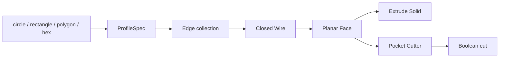

# 9 月 16 日变更日志：统一二维 Profile 编译层

## 1. 会话信息

| 项目 | 内容 |
|---|---|
| 日期 | 2026-09-16 |
| 里程碑 | M2 — 编译执行 + 评估框架 v1 |
| 工作范围 | `ProfileSpec`、完整 v1 operation set、`ResolvedSubshape`、checked CSG、edit/replace history rebuild |
| 环境 | Ubuntu 24.04、Python 3.11、FreeCAD 1.1.3 |
| 验证 | 259 个测试通过，Ruff 通过 |

## 2. 结果摘要

本次工作移除了 circle/rectangle 到 `Part.makeCylinder()` / `Part.makeBox()` 的硬编码映射。
所有支持的二维轮廓现在先规范化为 `ProfileSpec`，再由同一个 FreeCAD 编译路径生成封闭 Wire 和
Planar Face。Extrude 直接拉伸 Face；圆形 pocket 也通过同一个 Face 编译器生成 cutter 后执行布尔差。



## 3. 实现内容

### 3.1 ProfileSpec 规范化

- Circle 保留解析半径，以生成真正的圆弧 Edge。
- Rectangle 规范化为四点 polygon。
- Polygon 规范化为不重复终点的顶点环。
- `hex(r=...)` 生成正六边形顶点环，可以直接作为 extrude profile。
- 命名 sketch 在执行时就保存为 `ProfileSpec`，不再保存未校验的原始参数字典。

### 3.2 通用 FreeCAD 拓扑路径

所有 profile 使用以下流程：

```text
ProfileSpec → Edge → Closed Wire → Planar Face → Face.extrude()
```

测试会临时禁止调用 `Part.makeCylinder()` 和 `Part.makeBox()`，以确认 circle、rectangle、pocket
都没有退回 primitive 快捷路径。

### 3.3 Polygon 校验

在进入 OCCT 前检查：

- 点必须是二维 `[x, y]`，且至少有三个不同点；
- 显式重复的闭合终点会被规范化；
- 拒绝其他重复点、零面积、自相交；
- 坐标只接受无单位值或 `mm`，拒绝 `deg`。

### 3.4 参数真实性

- 一个 sketch 必须且只能定义 circle、rect、polygon 之一。
- sketch/circle/rect/hex/extrude/pocket/fillet 的未知参数会显式抛出 `CompileError`。
- 已解析参数必须产生可观察几何效果，或被明确拒绝，禁止静默忽略。

## 4. 测试覆盖

新增真实 FreeCAD/OCCT 测试覆盖：

- Circle、rectangle 与原有几何结果兼容；
- Polygon 三棱柱体积、拓扑与边界；
- 显式闭合 polygon 与隐式闭合结果一致；
- Inline hex 的面积和拉伸体积；
- YZ 平面的 polygon 坐标变换；
- Extrude 与 pocket 不调用 cylinder/box primitive；
- 重复点、自相交、零面积、错误单位与未知参数的错误契约。

最终结果：

```text
259 passed
All checks passed!  # Ruff
```

## 5. 可视化 Profile 测试画廊

`scripts/render_section3_report.py` 不再只展示圆柱轴示例。报告新增 rectangle、triangle polygon、
inline hex 和 YZ 平面 polygon，每个模型包含等轴、顶视、侧视、几何指标、DSL 源码和 STL。报告现场
运行八个对应的 FreeCAD 内核测试，便于同时核对视觉结果和数值断言。报告首屏还新增固定比例的
`edit` 200→250 mm 和 `replace` circle→hex 修改前后对比，确认下游 pocket 被重新构建。另使用固定随机种子
`20260916` 生成一个十顶点凹多边形，确保不规则模型可以复现并接受同一套 profile 校验。

## 6. 稳定 Symbolic Role Resolver

新增 `dsl/subshapes.py`，统一解析 `face_top`、`face_bottom`、`edge_top`、`edge_bottom`、`wall` 和
`floor`。`ResolvedSubshape` 记录 source feature/operation、history version、B-rep SHA-256、候选数、
逐步过滤证据、基数契约、选择理由，以及 centroid、area/length、orientation、bounds 和 geometry type。

- `face_top` / `face_bottom` 必须唯一，0 个或多个候选都抛出 `CompileError`；
- Edge/wall collection 使用 nonempty-many 契约并稳定排序，不再选择任意第一项；
- `edge_top` 使用 top face 的 outer wire，自动排除 pocket 孔口内缘；
- Body 外壁与 pocket 内壁保留不同 operation provenance；
- 连续 pocket/fillet 后通过 history version 追踪当前 tip，body wall 同时保留圆柱面与圆角过渡面。

P0 状态记录在 `docs/p0_geometry_fidelity.md`。完整 geometry-fidelity gate 已通过。

新增独立 `scripts/render_p0_report.py`：报告用彩色 overlay 标出 resolver 返回的真实 OCCT face/edge，
用剖切视图展示深孔 `floor` 和 `wall`，并列出 provenance、revision、B-rep hash、cardinality、过滤步骤
和几何签名。报告同时展示歧义拒绝与 edit/replace 固定比例前后对比，并显示 P0 PASS。
报告页面文案统一使用英文，便于直接用于英文演示与验收。

## 7. Edit / Replace Feature-History Rebuild

FreeCAD backend 现在保存可重放的 feature history。`edit` 修改目标 feature 的顶层参数，`replace`
在保留原 feature 名称的前提下替换 operation/arguments；随后从目标开始提升 revision，并按源码顺序
重新生成全部历史，使 downstream pocket/fillet 自动绑定到新几何。

重建采用事务语义：负尺寸、未实现 operation 或 forward history dependency 导致失败时，会恢复旧记录
并重新生成最后一个有效 B-rep。测试覆盖 body length、pocket depth、连续 fillet、circle→hex replace、
回滚、历史版本和 document object 清理。

## 8. 完整 Operation Set 与 Checked CSG

- `revolve`：封闭 Profile 围绕草图内轴生成实体，并验证 cap/edge/wall roles。
- `chamfer`：对 `edge_top` resolver 返回的完整 outer-wire edge 集合倒角。
- `groove`：将轴向 Profile 旋转为 cutter；新增圆柱形 `floor` 与两侧 `wall` 解析。
- `pattern`：支持 linear/circular solid pattern；pocket/groove 会复制 cutter effect，而非整个零件。
- `mirror`：支持 XY/XZ/YZ 上的 solid 或 modifier-effect 镜像。
- `constraint`：校验并保存 v1 declaration，留给 P3 verify layer 执行。

Subtractive Boolean 现在检查 cutter 有效性、非零相交、非整体验除；pocket 还检查轮廓包含关系、
边界间距和 blind-floor 合同。Boolean/fuse 后必须得到有效非空 B-rep 且体积发生可测变化；重复 pattern
和无变化 mirror 会明确报错。`center=origin` 与 `center=body.axis` 也已生成不同几何。

## 9. 文档与计划

- `docs/compiler_status.md` 已更新为统一 Profile pipeline 的当前状态。
- 中英文 `docs/weekly_plan*.md` 已同步勾选完成项。
- 非 XY 平面与稳定 symbolic-role → subshape resolver 已完成。

## 10. 已知限制与下一步

1. Pocket 目前仍只接受 inline circle，尚未支持 face-local 的任意引用 sketch。
2. Through-pocket 在 v1 明确拒绝，以保证 pocket 承诺的 `floor` role 始终存在。
3. Pattern instance selector / wrong-binding evidence 属于 P2；constraint enforcement 属于 P3。
4. 下一步进入 P1 typed units，同时保持 P0 regression suite。
