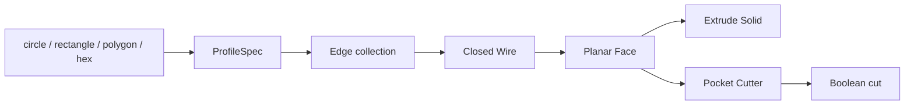

# September 16 Changelog: Unified 2D Profile Compiler

## 1. Session

| Item | Value |
|---|---|
| Date | 2026-09-16 |
| Milestone | M2 — Compiler + Eval Harness v1 |
| Scope | `ProfileSpec`, complete v1 operation set, `ResolvedSubshape`, checked CSG, edit/replace history rebuild |
| Environment | Ubuntu 24.04, Python 3.11, FreeCAD 1.1.3 |
| Verification | 259 tests passed; Ruff passed |

## 2. Summary

This change removes the hard-coded circle/rectangle mapping to `Part.makeCylinder()` and
`Part.makeBox()`. Every supported 2D profile is normalized to `ProfileSpec` and compiled through one
FreeCAD path that creates a closed Wire and planar Face. Extrude pulls that Face into a Solid, while
the circular pocket uses the same Face compiler to create its boolean cutter.



## 3. Implementation

- Circles retain an analytic radius; rectangles become four-point polygons; polygons become normalized
  vertex loops; and `hex(r=...)` generates a regular six-point loop.
- Named sketches are stored as validated `ProfileSpec` instances rather than raw argument dictionaries.
- Polygon validation rejects malformed points, duplicates, zero area, self-intersection, and angular
  units. Explicitly closed lists are accepted and normalized.
- A sketch must define exactly one profile type.
- Unknown arguments on implemented profile and kernel operations raise an explicit `CompileError`.
- Circle, rectangle, polygon, hex, extrude, and the circular pocket share the common Face path.

## 4. Tests

Real FreeCAD/OCCT coverage now verifies polygon and hex volume, explicit closure, YZ-plane placement,
shared pocket compilation, primitive-shortcut removal, invalid polygons, unit contracts, and unknown
arguments. The final result is:

```text
259 passed
All checks passed!  # Ruff
```

## 5. Visual Profile Test Gallery

`scripts/render_section3_report.py` now renders more than the cylindrical shaft example. The report
adds rectangle, triangle polygon, inline hex, and YZ-plane polygon models, each with isometric/top/side
views, geometry metrics, DSL source, and STL output. Eight matching FreeCAD kernel tests run live in the
report. Its first section adds fixed-scale before/after comparisons for the 200-to-250 mm `edit` and
circle-to-hex `replace`, confirming that the downstream pocket is rebuilt. A ten-vertex concave polygon generated from fixed random seed `20260916` provides a
reproducible irregular-profile example that passes the same compiler validation.

## 6. Stable Symbolic Role Resolver

The new `dsl/subshapes.py` resolves `face_top`, `face_bottom`, `edge_top`, `edge_bottom`, `wall`, and
`floor` through one `ResolvedSubshape` contract. Each binding records feature/operation provenance,
history version, B-rep SHA-256, candidates and filter steps, cardinality, selection reason, and
geometric signatures. Unique roles reject zero or ambiguous matches, while collection roles return a
nonempty, stably ordered set. The top outer wire excludes pocket rims, and body-wall versus pocket-wall
semantics stay distinct across chained pocket/fillet history.

The complete P0 geometry-fidelity gate now passes; see `docs/p0_geometry_fidelity.md`.

The standalone `scripts/render_p0_report.py` now overlays the exact OCCT faces and edges returned by
the resolver, uses section views for the deep pocket floor and wall, and prints provenance, revision,
B-rep hash, cardinality, filter steps, and signatures. It also visualizes ambiguity rejection and
fixed-scale edit/replace comparisons and now reports P0 PASS.
All report-facing copy is in English so the dashboard can be used directly for review and presentation.

## 7. Edit / Replace Feature-History Rebuild

The FreeCAD backend now stores replayable feature history. `edit` changes a target's top-level
argument, while `replace` swaps its operation and arguments under the same authored name. Revisions
advance from the target onward and the history replays in source order, rebuilding downstream
pocket/fillet features against the new geometry.

Rebuild is transactional: invalid dimensions, unsupported replacement operations, and forward history
dependencies restore the prior records and regenerate the last valid B-rep. Tests cover body length,
pocket depth, chained fillet, circle-to-hex replacement, rollback, revisions, and document cleanup.

## 8. Complete Operation Set and Checked CSG

- `revolve` creates a solid from a closed Profile and validates promised cap/edge/wall roles.
- `chamfer` consumes the complete outer-wire edge set returned by `edge_top`.
- `groove` revolves an axial Profile into a cutter and resolves cylindrical `floor` plus side `wall` faces.
- `pattern` supports linear/circular solids and replays pocket/groove cutter effects instead of copying a whole modified part.
- `mirror` reflects solids or modifier effects across XY/XZ/YZ.
- `constraint` validates and retains the v1 declaration for later P3 enforcement.

Subtractive Booleans now check valid cutters, nonzero intersection, non-erasure, and valid nonempty
results with measurable volume changes. Pocket also enforces containment, clearance, and a blind-floor
contract. Duplicate patterns and no-op mirrors raise explicitly. `center=origin` and
`center=body.axis` now produce distinct geometry.

## 9. Documentation and Next Work

`docs/compiler_status.md` and both weekly plans now reflect the completed Profile pipeline and role
resolver. Pocket is still limited to an inline circle and explicitly rejects through cuts so its v1
`floor` role remains valid. P2 owns instance selectors and wrong-binding evidence; P3 owns executable
constraint obligations. The next step is P1 typed units while preserving the P0 regression suite.
