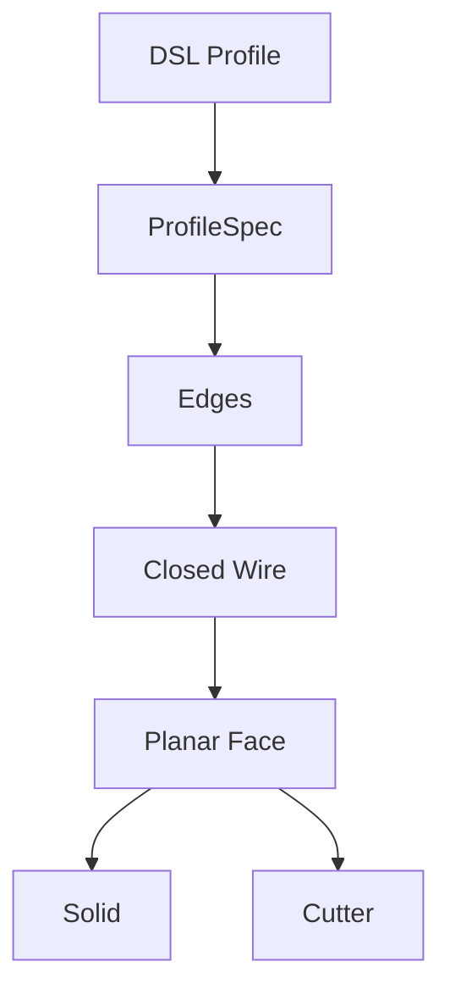

# 统一二维 Profile 编译层

## 本次完成

- Circle / rectangle / polygon / hex → `ProfileSpec`
- 统一 `Edge → Closed Wire → Planar Face`
- Extrude 与 pocket 复用 Face compiler
- 支持 XY/XZ/YZ 平面
- Polygon 几何校验与未知参数拒绝
- 可视化报告新增 rectangle / triangle / hex / YZ polygon / 随机凹多边形画廊
- 可视化报告首屏新增 edit / replace 固定比例修改前后对比
- 独立 P0 报告：完整 operation 画廊、彩色 role 绑定、孔内剖切与 PASS gate
- `ResolvedSubshape` provenance、几何签名、过滤证据和基数契约
- `face_top` / `edge_top` / `wall` / `floor` 稳定解析
- Transactional edit/replace history rebuild 与失败回滚
- 完成 revolve / chamfer / groove / pattern / mirror / constraint
- Checked CSG 前后置条件与 no-op 拒绝
- 259 个测试通过

## 关键变化

过去每个 profile 单独调用 primitive；现在新增形状只需提供 Edge/vertex 生成逻辑，后续拓扑和三维操作全部复用。

## 下一步

进入 P1 typed units，并保持 P0 regression suite。
