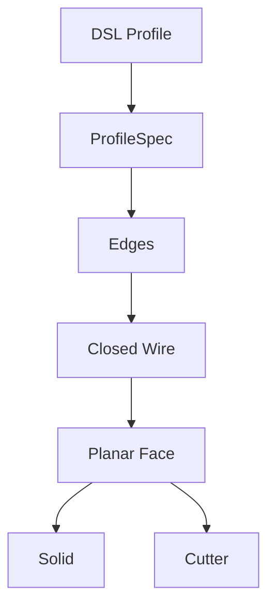

# Unified 2D Profile Compiler

## Completed

- Circle / rectangle / polygon / hex → `ProfileSpec`
- Shared `Edge → Closed Wire → Planar Face`
- One Face compiler for extrude and pocket
- XY/XZ/YZ plane support
- Polygon validation and explicit unknown-argument errors
- Visual report gallery for rectangle / triangle / hex / YZ polygon / random concave polygon
- Fixed-scale edit / replace before-and-after comparisons at the top of the visual report
- Standalone P0 report with the complete operation gallery, colored bindings, sections, and PASS gate
- `ResolvedSubshape` provenance, signatures, filter evidence, and cardinality contracts
- Stable `face_top` / `edge_top` / `wall` / `floor` resolution
- Transactional edit/replace history rebuild with rollback
- Complete revolve / chamfer / groove / pattern / mirror / constraint implementation
- Checked CSG pre/postconditions and explicit no-op rejection
- 259 tests passing

## Architectural Change

Profiles no longer select dedicated primitives. A new shape now needs only an Edge/vertex generator;
the topology construction and 3D operations stay shared.

## Next

Start P1 typed units while preserving the P0 regression suite.
