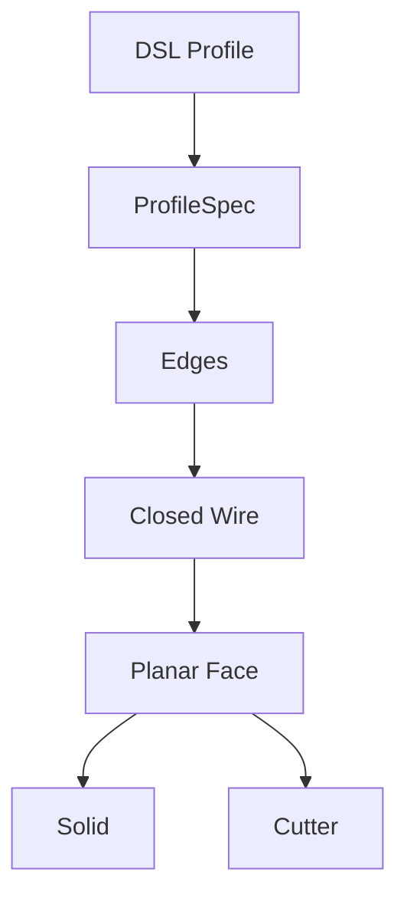

# 통합 2D Profile 컴파일러

## 완료 항목

- Circle / rectangle / polygon / hex → `ProfileSpec`
- 공통 `Edge → Closed Wire → Planar Face` 경로
- Extrude와 pocket이 동일한 Face compiler 사용
- XY/XZ/YZ 평면 지원
- Polygon 검증 및 알 수 없는 인자 명시적 거부
- Rectangle / triangle / hex / YZ polygon / 무작위 오목 다각형 시각화 갤러리
- 시각화 보고서 첫 화면에 고정 축척 edit / replace 전후 비교 추가
- 전체 operation 갤러리, 역할 바인딩, 단면 및 PASS gate를 담은 독립 P0 보고서
- `ResolvedSubshape` provenance, geometry signature, filter evidence 및 cardinality 계약
- 안정적인 `face_top` / `edge_top` / `wall` / `floor` 해석
- Transactional edit/replace history rebuild 및 실패 rollback
- revolve / chamfer / groove / pattern / mirror / constraint 구현 완료
- Checked CSG 사전/사후 조건 및 no-op 명시적 거부
- 테스트 259개 통과

## 구조 변경

Profile별 primitive 선택을 제거했다. 새로운 도형은 Edge 또는 vertex 생성기만 추가하면 되며,
topology 구성과 3D operation은 공통 경로를 재사용한다.

## 다음 작업

P0 regression suite를 유지하면서 P1 typed units를 시작한다.
