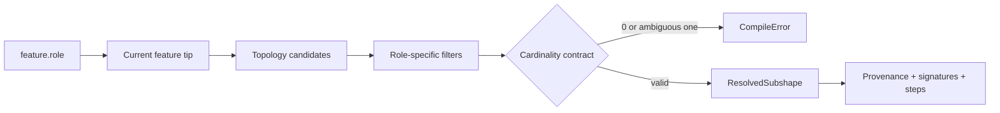

# P0 Geometry Fidelity Acceptance Status

> Status: **PASS — geometry-fidelity baseline complete**
>
> This report tracks the P0 acceptance gate defined in `physics-cad-dsl-design-spec.md`. P0 passing
> establishes geometry fidelity only; it does not claim that P1–P6 physical verification is complete.

## Current Acceptance Matrix

| P0 requirement | Status | Evidence |
|---|---|---|
| Unified `ProfileSpec → Edge → Wire → Face` | PASS | Circle, rectangle, polygon, and hex real-kernel tests |
| Every accepted implemented argument affects geometry or raises | PASS | Unknown-argument and unit error-contract tests |
| XY/XZ/YZ planes, directions, and centers | PASS | Geometry, resolver, and distinct pocket-center tests |
| Provenance-carrying `ResolvedSubshape` | PASS for v1 roles below | `tests/test_subshape_resolver.py` |
| Explicit cardinality; no silent first match | PASS for v1 roles below | Ambiguous two-cap test raises `CompileError` |
| Stable role resolver | PASS for v1 single-body roles, including pocket and groove `wall` / `floor` | Real OCCT tests before and after modifiers |
| Explicit feature-history rebuild for `edit` / `replace` | PASS | Transactional replay and rollback across the complete operation set |
| Complete v1 operation set | PASS | revolve/chamfer/groove/pattern/mirror/constraint real-kernel tests |
| Checked Boolean preconditions and postconditions | PASS | Clearance, nonzero intersection, non-erasure, valid/nonempty B-rep, and measurable-change tests |

## ResolvedSubshape Contract

Every successful role resolution returns:

- source feature and source operation;
- monotonically increasing feature history version;
- SHA-256 hash of the current source B-rep;
- OCCT topology kind;
- expected and actual cardinality;
- initial candidate count and every filtering step;
- stable geometric ordering;
- centroid, area/length, orientation, bounds, and geometry type for each result;
- a human-readable reason for the final binding.

Roles with `one` cardinality reject both zero and multiple matches. Roles with `many` cardinality
require a nonempty set and return every entity in deterministic geometric order. Consumers such as
fillet therefore receive the complete top outer wire instead of an arbitrary first edge.

## Current Semantic Scope

- `face_top` / `face_bottom`: unique planar cap at the maximum/minimum feature-axis extent.
- `edge_top` / `edge_bottom`: every edge in the resolved cap's outer wire; hole rims are excluded.
- Extrude `wall`: the connected lateral component reached from the top outer wire without crossing an
  axis-normal cap or floor. This retains both the original wall and fillet transition faces.
- Pocket `floor`: unique nearest upward planar face below the top cap.
- Pocket `wall`: lateral component reached from the pocket floor boundary, distinct from the body wall.
- Groove `floor`: unique deepest coaxial cylindrical face.
- Groove `wall`: every face sharing a boundary edge with the resolved groove floor.
- Revolve caps, edges, and outer walls use the same axis-relative cap and boundary contracts as extrude.

## Checked CSG Contract

Before a subtractive Boolean, the backend verifies that the cutter is a valid nonzero solid, has a
nonzero intersection with the target, and does not erase the target. Pocket additionally requires its
profile to be fully contained with positive boundary clearance. Because every v1 pocket exposes a
`floor` role, through-pockets are explicitly rejected instead of producing a feature whose promised
role cannot resolve.

After cut/fuse, the backend requires a valid, nonempty B-rep and a measurable volume change. Duplicate
circular patterns and symmetry-plane mirrors are rejected as no-ops. Disconnected linear-pattern
instances remain valid multi-body results and are returned together rather than silently dropping a
body.

## P0 Scope Boundary

- `constraint` is validated and retained as a first-class v1 declaration. Turning declarations into
  pass/fail/unknown engineering obligations is the P3 gate.
- `pat1[*]` / `pat1[2]` instance-role expansion and generic selector syntax are P2/M6 work, as fixed
  by `grammar.md` §8; P0 verifies pattern geometry and explicit no-op/failure behavior.
- The B-rep hash covers current geometry. Full model-input hashes and wrong-binding-rate evidence are
  P2 deliverables.
- Checked CSG covers formalizable preconditions and kernel postconditions; it does not claim arbitrary
  OCCT Boolean operations are mathematically total.
